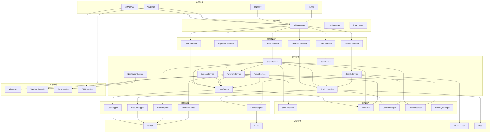
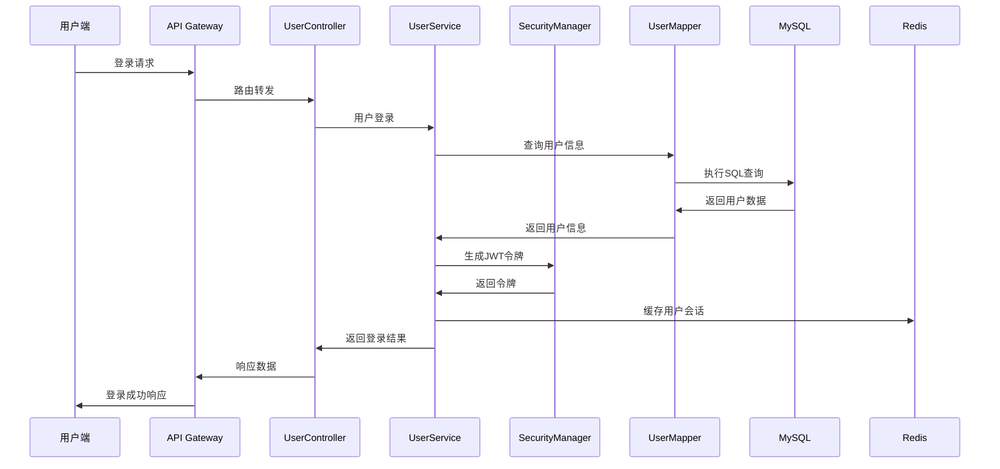
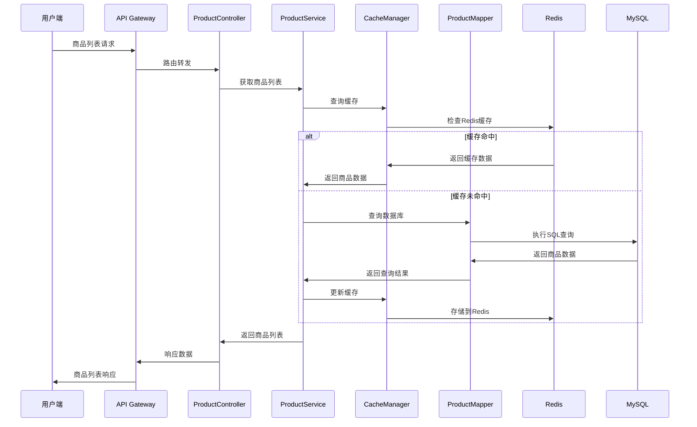
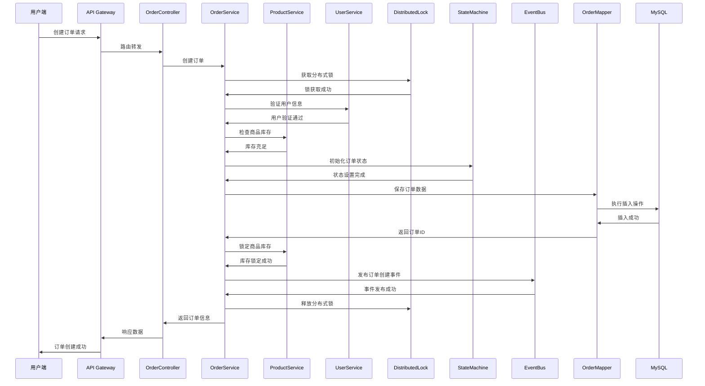
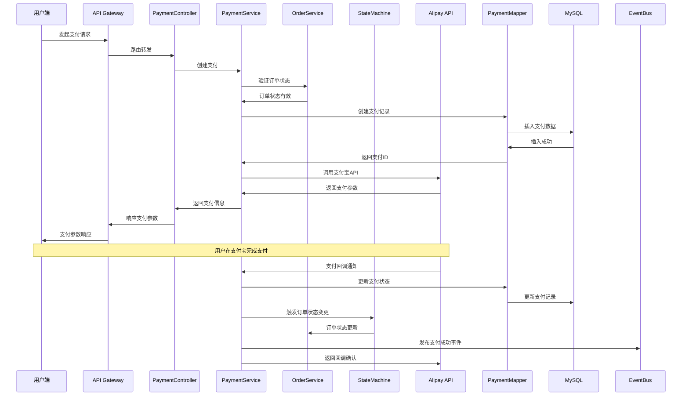
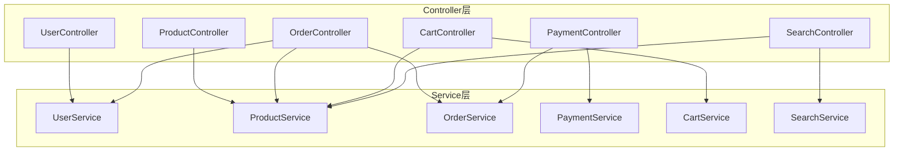
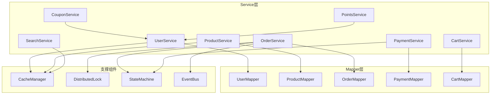
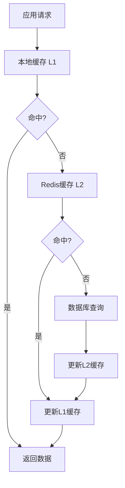

# 母婴商城组件交互设计

## 概述

本文档详细描述了母婴商城系统中各个组件之间的交互关系，包括组件依赖、数据流向、接口定义等，为系统的开发、维护和扩展提供指导。

## 组件交互总览



## 核心交互流程

### 1. 用户认证流程



### 2. 商品浏览流程



### 3. 订单创建流程



### 4. 支付处理流程



## 组件依赖关系

### Controller层依赖


### Service层依赖


## 接口定义规范

### RESTful API设计
```yaml
用户相关接口:
  - POST /api/v1/users/register     # 用户注册
  - POST /api/v1/users/login        # 用户登录
  - GET  /api/v1/users/profile      # 获取用户信息
  - PUT  /api/v1/users/profile      # 更新用户信息

商品相关接口:
  - GET  /api/v1/products           # 商品列表
  - GET  /api/v1/products/{id}      # 商品详情
  - GET  /api/v1/categories         # 分类列表
  - GET  /api/v1/brands             # 品牌列表

订单相关接口:
  - POST /api/v1/orders             # 创建订单
  - GET  /api/v1/orders             # 订单列表
  - GET  /api/v1/orders/{id}        # 订单详情
  - PUT  /api/v1/orders/{id}/cancel # 取消订单

支付相关接口:
  - POST /api/v1/payments           # 创建支付
  - GET  /api/v1/payments/{id}      # 支付详情
  - POST /api/v1/payments/callback  # 支付回调
```

### 内部服务接口
```java
// 用户服务接口
public interface UserService {
    User getUserById(Integer userId);
    User getUserByUsername(String username);
    boolean validateUser(String username, String password);
    String generateToken(User user);
}

// 商品服务接口
public interface ProductService {
    List<Product> getProductsByCategory(Integer categoryId);
    Product getProductById(Integer productId);
    boolean checkStock(Integer productId, Integer quantity);
    void lockStock(Integer productId, Integer quantity);
}

// 订单服务接口
public interface OrderService {
    Order createOrder(OrderCreateRequest request);
    Order getOrderById(Integer orderId);
    void updateOrderStatus(Integer orderId, OrderStatus status);
    void cancelOrder(Integer orderId);
}
```

## 事件驱动架构

### 事件定义
```java
// 订单事件
public class OrderCreatedEvent {
    private Integer orderId;
    private Integer userId;
    private BigDecimal amount;
    private LocalDateTime createTime;
}

public class OrderPaidEvent {
    private Integer orderId;
    private Long paymentId;
    private LocalDateTime payTime;
}

// 支付事件
public class PaymentSuccessEvent {
    private Long paymentId;
    private Integer orderId;
    private BigDecimal amount;
    private String paymentMethod;
}
```

### 事件处理器
```java
@Component
public class OrderEventHandler {
    
    @EventListener
    public void handleOrderCreated(OrderCreatedEvent event) {
        // 发送订单确认通知
        // 更新用户积分
        // 记录操作日志
    }
    
    @EventListener
    public void handleOrderPaid(OrderPaidEvent event) {
        // 更新库存
        // 发送发货通知
        // 更新订单状态
    }
}
```

## 缓存交互策略

### 缓存层次结构


### 缓存更新策略
```java
@Service
public class ProductService {
    
    @Cacheable(value = "products", key = "#productId")
    public Product getProductById(Integer productId) {
        return productMapper.selectById(productId);
    }
    
    @CacheEvict(value = "products", key = "#product.productId")
    public void updateProduct(Product product) {
        productMapper.updateById(product);
        // 发送缓存失效事件
        eventBus.publish(new CacheInvalidateEvent("products", product.getProductId()));
    }
}
```

## 异常处理机制

### 全局异常处理
```java
@RestControllerAdvice
public class GlobalExceptionHandler {
    
    @ExceptionHandler(BusinessException.class)
    public ApiResponse<Void> handleBusinessException(BusinessException e) {
        return ApiResponse.failed(e.getCode(), e.getMessage());
    }
    
    @ExceptionHandler(ValidationException.class)
    public ApiResponse<Void> handleValidationException(ValidationException e) {
        return ApiResponse.failed(ApiErrorCodes.PARAM_ERROR, e.getMessage());
    }
}
```

### 服务间异常传播
```java
public class ServiceException extends RuntimeException {
    private String serviceCode;
    private String errorCode;
    private String errorMessage;
    
    // 异常链传播
    public ServiceException(String serviceCode, String errorCode, String errorMessage, Throwable cause) {
        super(errorMessage, cause);
        this.serviceCode = serviceCode;
        this.errorCode = errorCode;
        this.errorMessage = errorMessage;
    }
}
```

---
*最后更新时间: 2025-06-18*
*维护者: 青柠檬*
