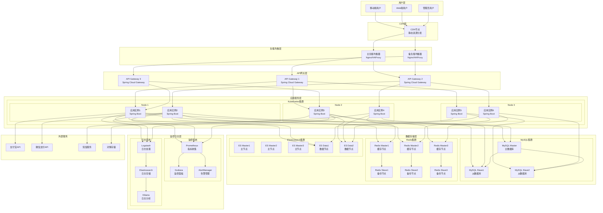
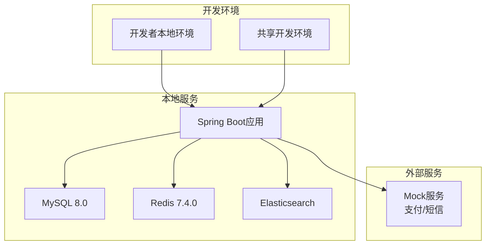
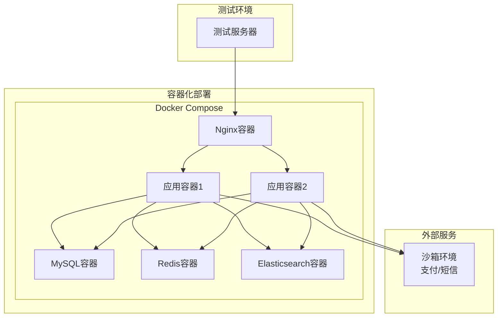
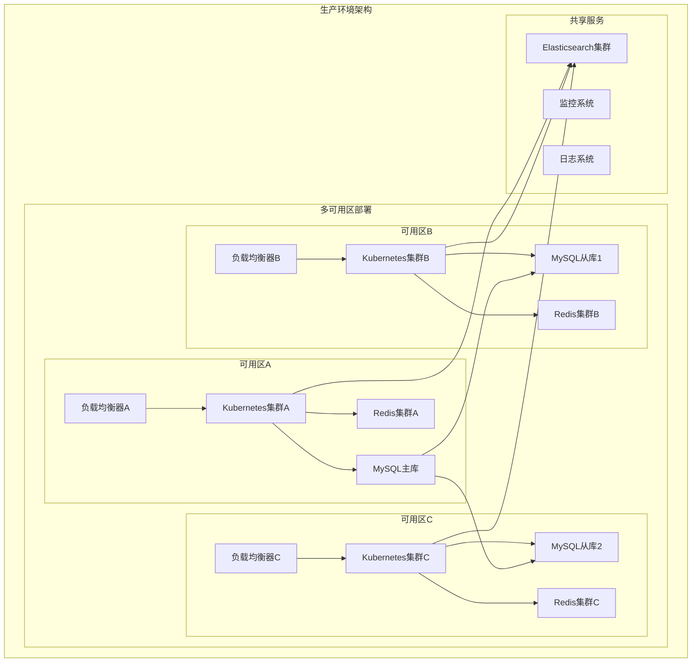
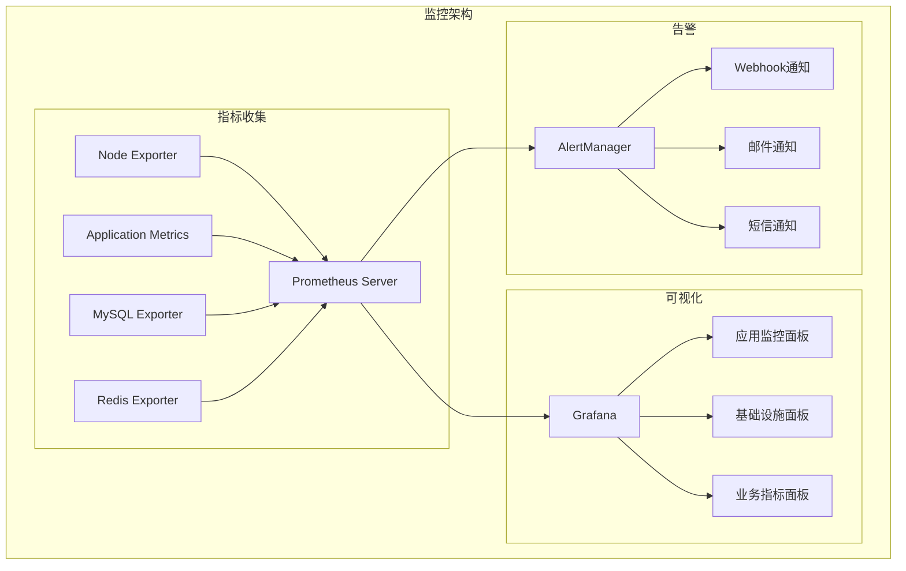
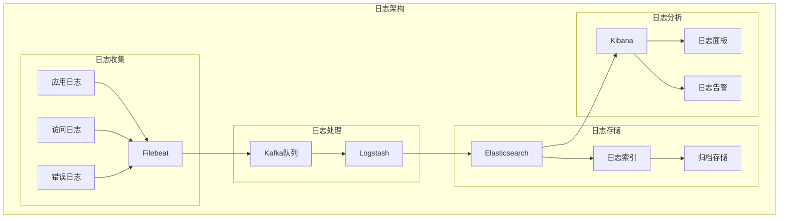
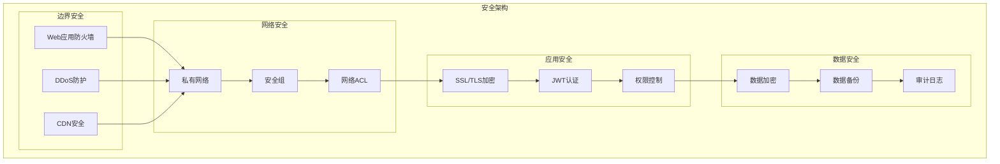
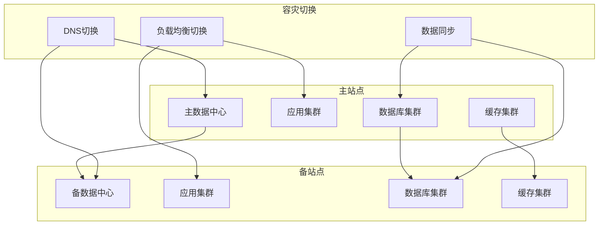

# 母婴商城部署架构设计

## 概述

本文档描述了母婴商城系统在不同环境下的部署架构设计，包括开发环境、测试环境和生产环境的部署方案，以及容器化、监控、日志等基础设施的配置。

## 部署架构总览



## 环境部署方案

### 开发环境 (Development)



**配置特点**：
- 单机部署，资源占用小
- 使用内嵌数据库或轻量级数据库
- Mock外部服务，避免真实调用
- 热部署支持，提高开发效率

**环境配置**：
```yaml
# application-dev.yml
server:
  port: 8080

spring:
  datasource:
    url: jdbc:mysql://localhost:3306/muying_mall_dev
    username: dev_user
    password: dev_password
  
  redis:
    host: localhost
    port: 6379
    database: 0
  
  elasticsearch:
    uris: http://localhost:9200

logging:
  level:
    com.muyingmall: DEBUG
```

### 测试环境 (Testing)



**配置特点**：
- Docker容器化部署
- 多实例负载均衡
- 使用沙箱环境测试外部服务
- 自动化测试集成

**Docker Compose配置**：
```yaml
version: '3.8'
services:
  app:
    image: muying-mall:latest
    ports:
      - "8080-8082:8080"
    environment:
      - SPRING_PROFILES_ACTIVE=test
    depends_on:
      - mysql
      - redis
    deploy:
      replicas: 2
  
  mysql:
    image: mysql:8.0
    environment:
      MYSQL_ROOT_PASSWORD: test_password
      MYSQL_DATABASE: muying_mall_test
    volumes:
      - mysql_data:/var/lib/mysql
  
  redis:
    image: redis:7.4.0-alpine
    volumes:
      - redis_data:/data
  
  nginx:
    image: nginx:alpine
    ports:
      - "80:80"
    volumes:
      - ./nginx.conf:/etc/nginx/nginx.conf
```

### 生产环境 (Production)



**配置特点**：
- 多可用区部署，高可用保障
- Kubernetes容器编排
- 数据库主从复制，读写分离
- Redis集群，分片存储
- 完整的监控和日志系统

## Kubernetes部署配置

### 应用部署配置

```yaml
# deployment.yaml
apiVersion: apps/v1
kind: Deployment
metadata:
  name: muying-mall-app
  namespace: production
spec:
  replicas: 6
  selector:
    matchLabels:
      app: muying-mall
  template:
    metadata:
      labels:
        app: muying-mall
    spec:
      containers:
      - name: app
        image: muying-mall:v1.0.0
        ports:
        - containerPort: 8080
        env:
        - name: SPRING_PROFILES_ACTIVE
          value: "prod"
        - name: MYSQL_HOST
          valueFrom:
            secretKeyRef:
              name: db-secret
              key: host
        resources:
          requests:
            memory: "512Mi"
            cpu: "500m"
          limits:
            memory: "1Gi"
            cpu: "1000m"
        livenessProbe:
          httpGet:
            path: /actuator/health
            port: 8080
          initialDelaySeconds: 60
          periodSeconds: 30
        readinessProbe:
          httpGet:
            path: /actuator/health/readiness
            port: 8080
          initialDelaySeconds: 30
          periodSeconds: 10
```

### 服务配置

```yaml
# service.yaml
apiVersion: v1
kind: Service
metadata:
  name: muying-mall-service
  namespace: production
spec:
  selector:
    app: muying-mall
  ports:
  - protocol: TCP
    port: 80
    targetPort: 8080
  type: ClusterIP

---
apiVersion: v1
kind: Service
metadata:
  name: muying-mall-lb
  namespace: production
spec:
  selector:
    app: muying-mall
  ports:
  - protocol: TCP
    port: 80
    targetPort: 8080
  type: LoadBalancer
```

### 配置管理

```yaml
# configmap.yaml
apiVersion: v1
kind: ConfigMap
metadata:
  name: app-config
  namespace: production
data:
  application.yml: |
    server:
      port: 8080
    spring:
      datasource:
        url: jdbc:mysql://${MYSQL_HOST}:3306/muying_mall
        username: ${MYSQL_USER}
        password: ${MYSQL_PASSWORD}
      redis:
        cluster:
          nodes: ${REDIS_NODES}
      elasticsearch:
        uris: ${ES_URIS}

---
apiVersion: v1
kind: Secret
metadata:
  name: db-secret
  namespace: production
type: Opaque
data:
  host: bXlzcWwtbWFzdGVyLnByb2R1Y3Rpb24uc3ZjLmNsdXN0ZXIubG9jYWw=
  username: cm9vdA==
  password: cGFzc3dvcmQ=
```

## 监控和日志架构

### 监控系统部署



### 日志系统部署



## 安全架构

### 网络安全



## 容灾和备份策略

### 数据备份

```yaml
备份策略:
  数据库备份:
    - 全量备份: 每日凌晨2点
    - 增量备份: 每4小时一次
    - 备份保留: 30天
    - 异地备份: 每周同步到异地
  
  Redis备份:
    - RDB快照: 每小时一次
    - AOF日志: 实时写入
    - 备份保留: 7天
  
  文件备份:
    - 应用文件: 版本控制
    - 配置文件: 配置中心
    - 日志文件: 7天滚动
```

### 容灾方案



---
*最后更新时间: 2025-06-18*
*维护者: 青柠檬*
