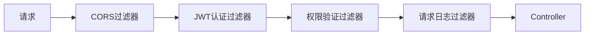
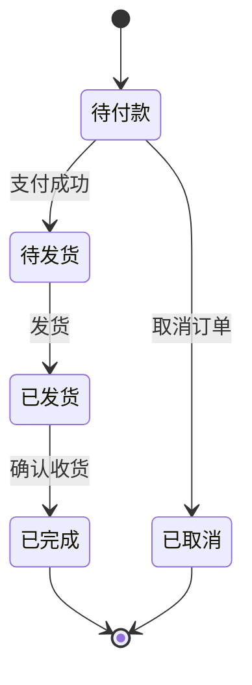
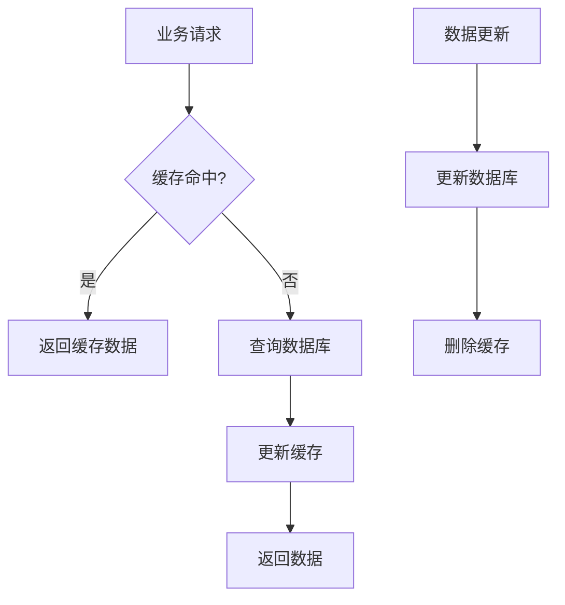
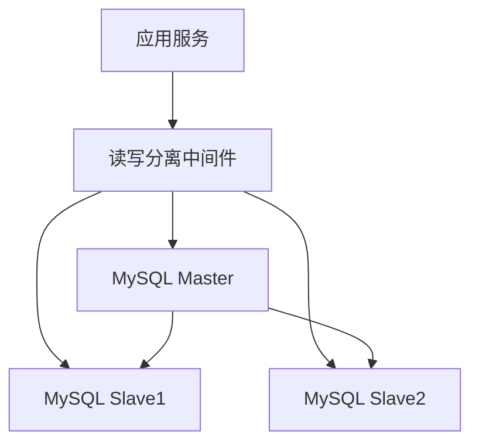
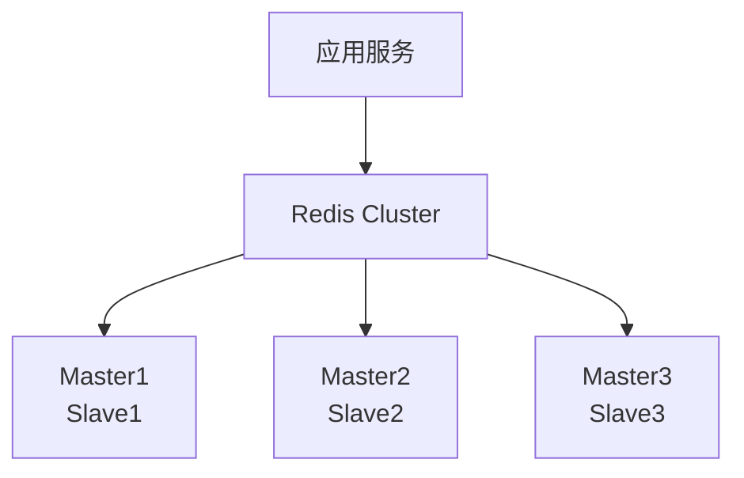
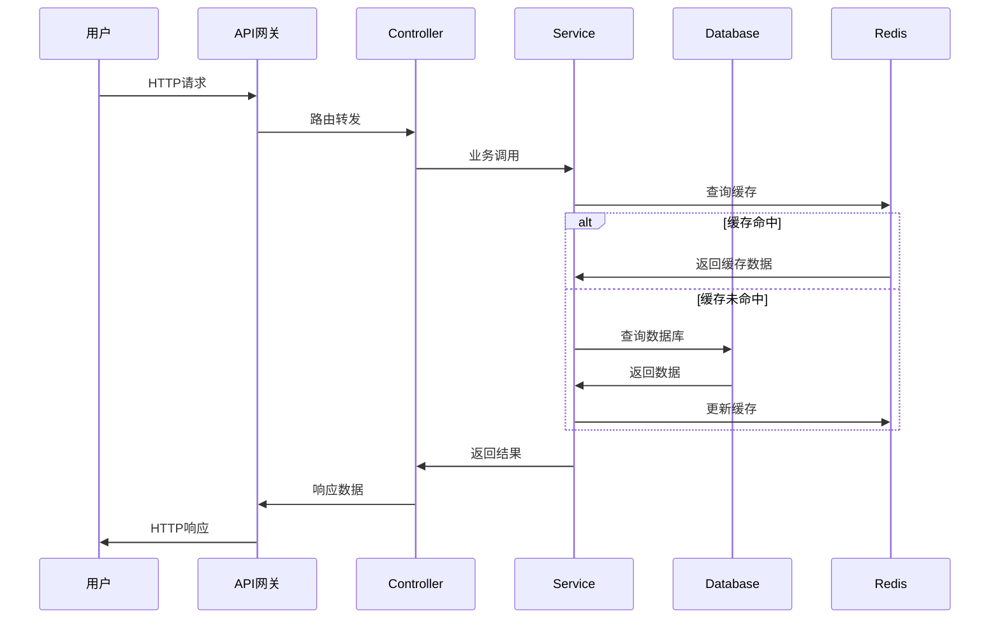
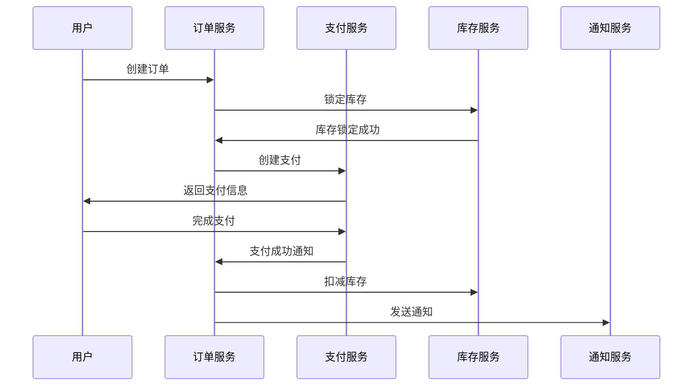

# 母婴商城系统架构设计

## 架构概述

母婴商城系统采用现代分层架构设计，基于Spring Boot框架构建。整个系统采用前后端分离模式，后端提供RESTful API，前端通过API调用获取数据并展示。系统在设计上充分考虑了高可用性、高性能和可扩展性。

## 系统架构图

```mermaid
graph TB
    subgraph "前端应用层"
        A1[用户移动端<br/>React Native/Flutter]
        A2[用户Web端<br/>Vue.js/React]
        A3[管理后台<br/>React/Vue Admin]
        A4[微信小程序<br/>Mini Program]
    end
    
    subgraph "API网关层"
        B1[Spring Cloud Gateway<br/>路由 | 负载均衡 | 限流]
        B2[Nginx<br/>静态资源 | SSL终结]
    end
    
    subgraph "应用服务层"
        C1[Controller层<br/>API接口处理]
        C2[Security Filter<br/>认证授权]
        C3[Global Exception Handler<br/>异常处理]
        C4[SpringDoc<br/>API文档]
    end
    
    subgraph "业务服务层"
        D1[UserService<br/>用户管理]
        D2[ProductService<br/>商品管理]
        D3[OrderService<br/>订单管理]
        D4[PaymentService<br/>支付管理]
        D5[CartService<br/>购物车]
        D6[SearchService<br/>搜索服务]
        D7[CouponService<br/>优惠券]
        D8[PointsService<br/>积分服务]
    end
    
    subgraph "通用支持层"
        E1[State Machine<br/>状态机引擎]
        E2[Event Bus<br/>事件总线]
        E3[Distributed Lock<br/>分布式锁]
        E4[TCC Transaction<br/>分布式事务]
        E5[Cache Manager<br/>缓存管理]
    end
    
    subgraph "数据访问层"
        F1[UserMapper<br/>用户数据访问]
        F2[ProductMapper<br/>商品数据访问]
        F3[OrderMapper<br/>订单数据访问]
        F4[PaymentMapper<br/>支付数据访问]
        F5[Cache Adapter<br/>缓存适配器]
    end
    
    subgraph "数据存储层"
        G1[MySQL Master<br/>主数据库]
        G2[MySQL Slave<br/>从数据库]
        G3[Redis Cluster<br/>缓存集群]
        G4[Elasticsearch<br/>搜索引擎]
        G5[OSS Storage<br/>对象存储]
    end
    
    subgraph "外部服务"
        H1[Alipay API<br/>支付宝支付]
        H2[WeChat Pay API<br/>微信支付]
        H3[SMS Service<br/>短信服务]
        H4[CDN Service<br/>内容分发]
    end
    
    subgraph "基础设施层"
        I1[Docker Container<br/>容器化]
        I2[Kubernetes<br/>容器编排]
        I3[ELK Stack<br/>日志分析]
        I4[Prometheus + Grafana<br/>监控告警]
    end
    
    %% 连接关系
    A1 --> B1
    A2 --> B1
    A3 --> B1
    A4 --> B1
    
    B1 --> C1
    B2 --> C1
    
    C1 --> D1
    C1 --> D2
    C1 --> D3
    C1 --> D4
    C1 --> D5
    C1 --> D6
    C1 --> D7
    C1 --> D8
    
    D1 --> E1
    D3 --> E1
    D4 --> E1
    D1 --> E2
    D3 --> E2
    D4 --> E2
    D1 --> E3
    D3 --> E3
    D4 --> E4
    D1 --> E5
    D2 --> E5
    
    D1 --> F1
    D2 --> F2
    D3 --> F3
    D4 --> F4
    D2 --> F5
    D6 --> F5
    
    F1 --> G1
    F2 --> G1
    F3 --> G1
    F4 --> G1
    F1 --> G2
    F2 --> G2
    F5 --> G3
    D6 --> G4
    D2 --> G5
    
    D4 --> H1
    D4 --> H2
    D1 --> H3
    A1 --> H4
    A2 --> H4
    
    G1 --> I1
    G2 --> I1
    G3 --> I1
    G4 --> I1
    I1 --> I2
    C1 --> I3
    D1 --> I4
    D2 --> I4
    D3 --> I4
```

## 架构层次详解

### 1. 前端应用层 (Presentation Layer)

#### 用户移动端
- **技术栈**: React Native / Flutter
- **功能**: 商品浏览、下单购买、个人中心
- **特点**: 原生性能、离线缓存、推送通知

#### 用户Web端  
- **技术栈**: Vue.js / React
- **功能**: 完整的电商功能，响应式设计
- **特点**: SEO友好、快速加载、PWA支持

#### 管理后台
- **技术栈**: React Admin / Vue Admin
- **功能**: 商品管理、订单管理、用户管理、数据统计
- **特点**: 权限控制、数据可视化、操作审计

#### 微信小程序
- **技术栈**: 微信小程序原生开发
- **功能**: 轻量级购物体验
- **特点**: 微信生态集成、社交分享

### 2. API网关层 (Gateway Layer)

#### Spring Cloud Gateway
```yaml
功能特性:
  - 路由管理: 动态路由配置
  - 负载均衡: 多实例负载分发
  - 限流控制: 令牌桶算法限流
  - 熔断降级: Circuit Breaker模式
  - 认证授权: JWT令牌验证
  - 请求日志: 访问日志记录
```

#### Nginx反向代理
```yaml
功能特性:
  - 静态资源服务: 图片、CSS、JS文件
  - SSL终结: HTTPS证书管理
  - 压缩传输: Gzip压缩
  - 缓存控制: 静态资源缓存
```

### 3. 应用服务层 (Application Layer)

#### Controller层设计
```java
@RestController
@RequestMapping("/api/v1")
@Tag(name = "API接口")
public class BaseController {
    // 统一的请求处理
    // 参数验证
    // 响应格式化
}
```

#### 安全过滤器链


### 4. 业务服务层 (Business Layer)

#### 核心服务设计

**用户服务 (UserService)**
```yaml
职责:
  - 用户注册登录
  - 个人信息管理
  - 地址管理
  - 积分账户管理
依赖:
  - UserMapper
  - RedisTemplate
  - JwtUtils
```

**商品服务 (ProductService)**
```yaml
职责:
  - 商品信息管理
  - 分类管理
  - 品牌管理
  - 库存管理
依赖:
  - ProductMapper
  - CategoryMapper
  - BrandMapper
  - CacheManager
```

**订单服务 (OrderService)**
```yaml
职责:
  - 订单创建
  - 状态流转
  - 物流管理
依赖:
  - OrderMapper
  - StateMachine
  - EventBus
  - DistributedLock
```

**支付服务 (PaymentService)**
```yaml
职责:
  - 支付处理
  - 回调处理
  - 退款管理
依赖:
  - PaymentMapper
  - AlipayClient
  - WechatPayClient
  - TCCTransaction
```

### 5. 通用支持层 (Infrastructure Layer)

#### 状态机引擎


#### 事件总线
```java
@EventListener
public void handleOrderPaid(OrderPaidEvent event) {
    // 更新库存
    // 发送通知
    // 记录日志
}
```

#### 分布式锁
```java
@DistributedLock(key = "product:#{productId}", timeout = 30)
public void updateStock(Integer productId, Integer quantity) {
    // 库存更新逻辑
}
```

### 6. 数据访问层 (Data Access Layer)

#### MyBatis-Plus配置
```yaml
mybatis-plus:
  mapper-locations: classpath:/mapper/**/*.xml
  type-aliases-package: com.muyingmall.entity
  configuration:
    map-underscore-to-camel-case: true
    log-impl: org.apache.ibatis.logging.stdout.StdOutImpl
  global-config:
    db-config:
      id-type: auto
      logic-delete-field: is_deleted
```

#### 缓存策略


### 7. 数据存储层 (Data Storage Layer)

#### MySQL集群架构


#### Redis集群架构


## 数据流向分析

### 用户请求流程


### 订单处理流程


## 扩展性设计

### 水平扩展
- 应用服务无状态设计，支持多实例部署
- 数据库读写分离，支持读库扩展
- 缓存集群化，支持分片扩展

### 垂直扩展
- 微服务架构，支持服务独立扩展
- 数据库分库分表，支持数据量扩展
- 消息队列异步处理，支持高并发

### 业务扩展
- 插件化设计，支持功能模块扩展
- 配置外部化，支持多环境部署
- API版本管理，支持向后兼容

## 性能优化策略

### 缓存优化
- 多级缓存：本地缓存 + Redis缓存
- 缓存预热：系统启动时预加载热点数据
- 缓存更新：数据变更时及时更新缓存

### 数据库优化
- 索引优化：为高频查询字段建立索引
- 查询优化：避免N+1查询，使用批量查询
- 连接池优化：合理配置连接池参数

### 应用优化
- 异步处理：耗时操作异步执行
- 批量处理：批量操作减少数据库交互
- 资源复用：连接池、线程池复用

---
*最后更新时间: 2025-06-18*
*维护者: 青柠檬*
