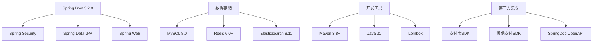
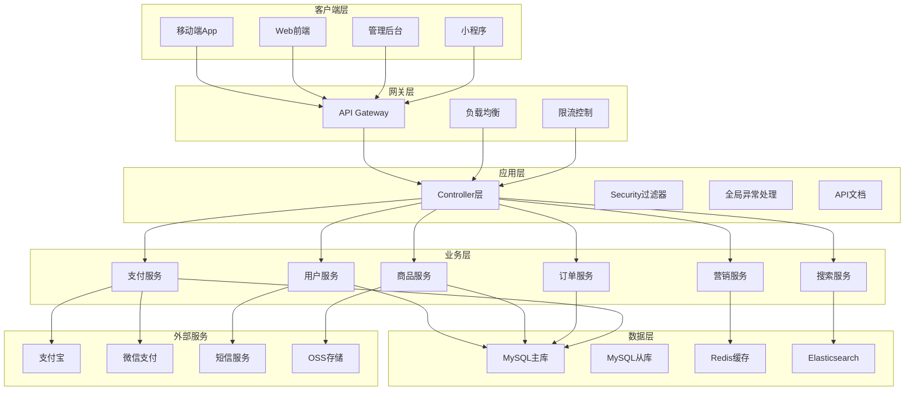

# 母婴商城系统概览

## 项目简介

母婴商城系统是一个基于Spring Boot 3.2.0构建的现代化电商平台，专注于母婴用品的在线销售。系统采用前后端分离架构，提供完整的电商功能，包括用户管理、商品管理、订单处理、支付集成、营销活动等核心模块。

## 系统特性

### 🎯 核心功能
- **用户体系**: 完整的用户注册、登录、信息管理体系
- **商品管理**: 支持多级分类、多规格、多图片的商品管理
- **购物体验**: 购物车、收藏、商品搜索、评价系统
- **订单处理**: 完整的订单生命周期管理，支持状态机流转
- **支付集成**: 集成支付宝、微信支付等主流支付方式
- **营销功能**: 优惠券系统、积分体系、会员等级
- **物流管理**: 物流跟踪、配送管理

### 🚀 技术特性
- **现代架构**: 基于Spring Boot 3.2.0，采用最新Java 21特性
- **高性能**: Redis缓存、Elasticsearch搜索、数据库优化
- **高可用**: 分布式架构设计，支持水平扩展
- **安全可靠**: Spring Security + JWT认证，数据加密存储
- **开发友好**: 完整的API文档、规范的代码结构

## 技术栈

### 后端技术栈

### 核心依赖版本
| 技术组件 | 版本 | 用途 |
|----------|------|------|
| Spring Boot | 3.2.0 | 核心框架 |
| Java | 21 | 运行环境 |
| MySQL | 8.0+ | 主数据库 |
| Redis | 7.4.0 | 缓存和会话存储 |
| Elasticsearch | 9.2.1 | 全文搜索引擎 |
| MyBatis-Plus | 3.5.9 | ORM框架 |
| Spring Security | 6.x | 安全框架 |
| JWT | 0.11.5 | 令牌认证 |
| SpringDoc | 2.2.0 | API文档生成 |
| Alipay SDK | 4.38.0 | 支付宝支付 |
| FastJSON2 | 2.0.40 | JSON处理 |

## 系统架构

### 整体架构图

### 分层架构说明

#### 1. 客户端层 (Presentation Layer)
- **移动端App**: 基于React Native或Flutter的移动应用
- **Web前端**: 基于Vue.js/React的单页应用
- **管理后台**: 基于React/Vue的后台管理系统
- **小程序**: 微信小程序端

#### 2. 网关层 (Gateway Layer)
- **API Gateway**: 统一入口，路由分发
- **负载均衡**: 请求分发，提高可用性
- **限流控制**: 防止系统过载

#### 3. 应用层 (Application Layer)
- **Controller层**: 处理HTTP请求，参数验证
- **Security过滤器**: 认证授权，安全控制
- **全局异常处理**: 统一异常处理和响应
- **API文档**: 自动生成和维护API文档

#### 4. 业务层 (Business Layer)
- **用户服务**: 用户注册、登录、信息管理
- **商品服务**: 商品管理、分类管理、搜索
- **订单服务**: 订单创建、状态管理、物流
- **支付服务**: 支付处理、退款管理
- **搜索服务**: 全文搜索、商品推荐
- **营销服务**: 优惠券、积分、活动管理

#### 5. 数据层 (Data Layer)
- **MySQL主库**: 核心业务数据存储
- **MySQL从库**: 读写分离，提高查询性能
- **Redis缓存**: 热点数据缓存，会话存储
- **Elasticsearch**: 全文搜索，商品检索

## 核心业务模块

### 用户管理模块
- 用户注册/登录
- 个人信息管理
- 收货地址管理
- 积分账户管理
- 会员等级体系

### 商品管理模块
- 商品信息管理
- 多级分类管理
- 品牌管理
- 商品规格管理
- 库存管理

### 订单管理模块
- 购物车管理
- 订单创建
- 订单状态流转
- 物流跟踪
- 退款处理

### 支付管理模块
- 多种支付方式
- 支付状态管理
- 支付回调处理
- 退款管理

### 营销管理模块
- 优惠券系统
- 积分体系
- 商品评价
- 收藏功能

## 系统优势

### 1. 技术先进性
- 采用最新的Spring Boot 3.2.0和Java 21
- 现代化的架构设计和开发模式
- 完整的微服务架构支持

### 2. 性能优化
- 多级缓存策略
- 数据库读写分离
- 全文搜索引擎
- 异步处理机制

### 3. 安全可靠
- 完善的认证授权机制
- 数据加密存储
- 防SQL注入和XSS攻击
- 完整的审计日志

### 4. 可扩展性
- 模块化设计
- 插件化架构
- 水平扩展支持
- 配置外部化

### 5. 开发友好
- 完整的API文档
- 规范的代码结构
- 丰富的开发工具
- 详细的技术文档

## 部署架构

### 开发环境
- 单机部署
- 内嵌数据库
- 本地缓存

### 测试环境
- 容器化部署
- 独立数据库
- Redis集群

### 生产环境
- Kubernetes集群
- 数据库集群
- 分布式缓存
- 负载均衡
- 监控告警

## 性能指标

### 系统容量
- 支持10万+注册用户
- 支持1万+商品SKU
- 支持1000+并发用户
- 支持100万+订单处理

### 响应时间
- API响应时间 < 200ms
- 页面加载时间 < 2s
- 搜索响应时间 < 100ms
- 支付处理时间 < 5s

### 可用性
- 系统可用性 > 99.9%
- 数据库可用性 > 99.99%
- 缓存可用性 > 99.9%

---
*最后更新时间: 2025-06-18*
*维护者: 青柠檬*
