# 母婴商城订单处理流程

## 概述

本文档详细描述了母婴商城系统中订单的完整生命周期，包括订单创建、支付、发货、配送、完成等各个环节的业务流程和状态管理。

## 订单状态机

### 订单状态流转图

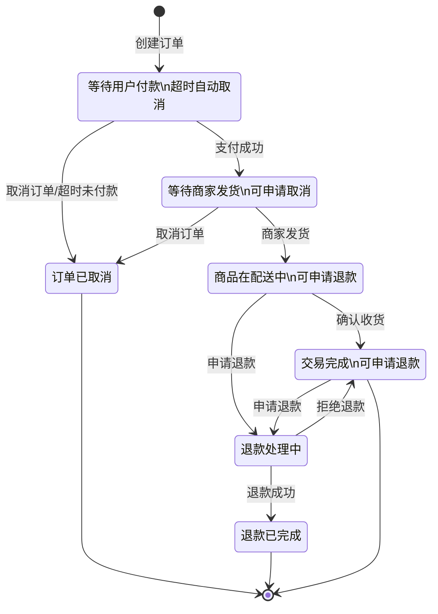

## 订单创建流程

### 订单创建流程图

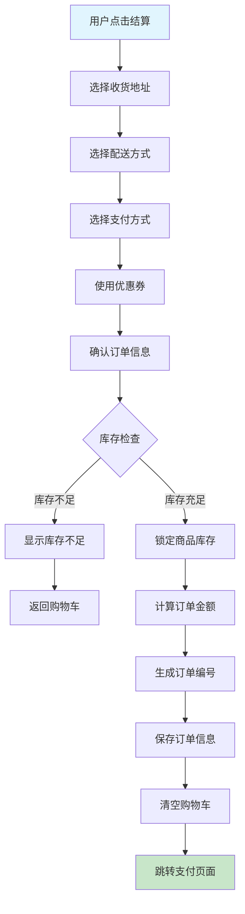

### 订单创建时序图

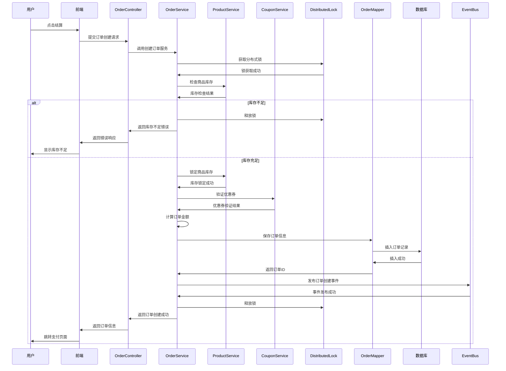

## 订单支付流程

### 支付流程图

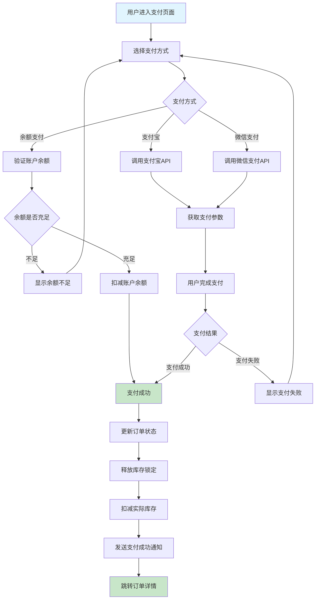

## 订单发货流程

### 发货流程图

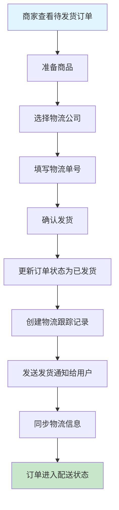

### 发货时序图

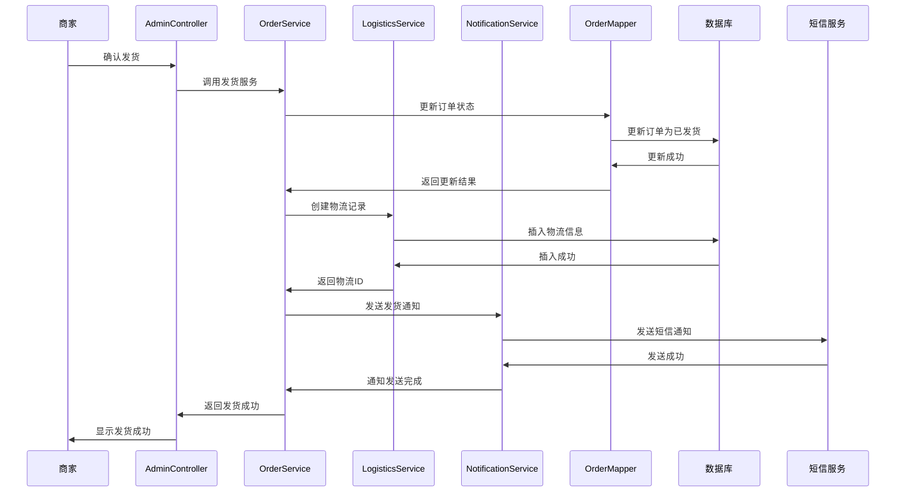

## 订单配送流程

### 配送状态跟踪

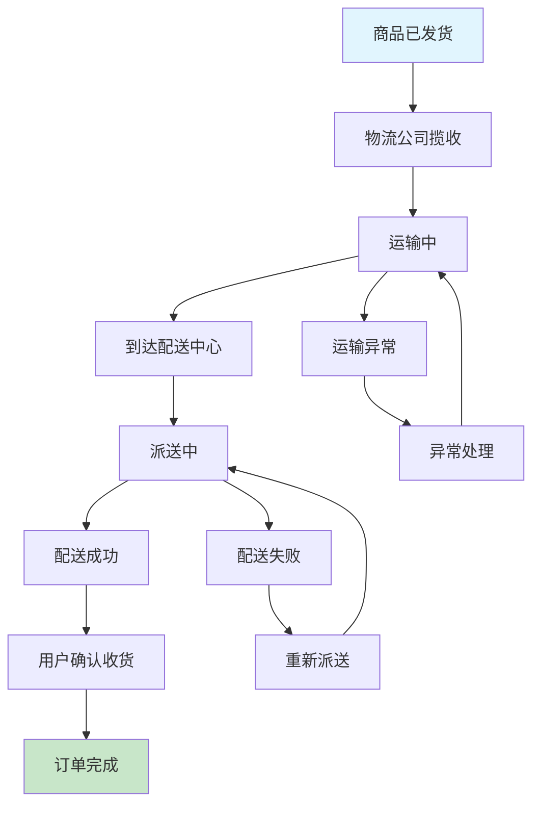

### 物流信息同步

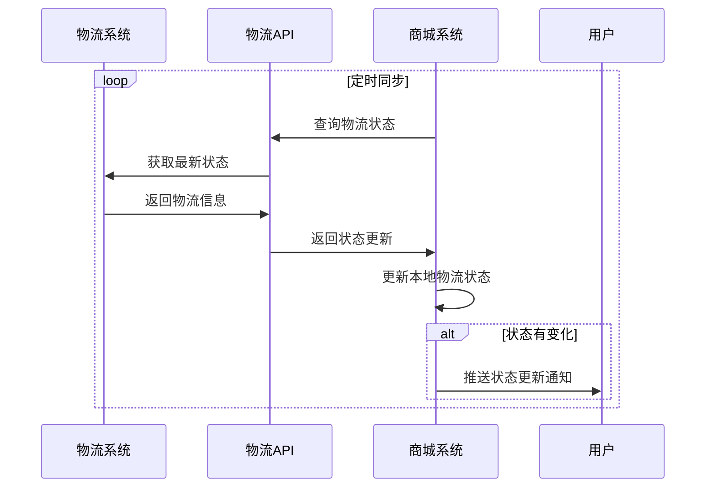

## 订单完成流程

### 确认收货流程

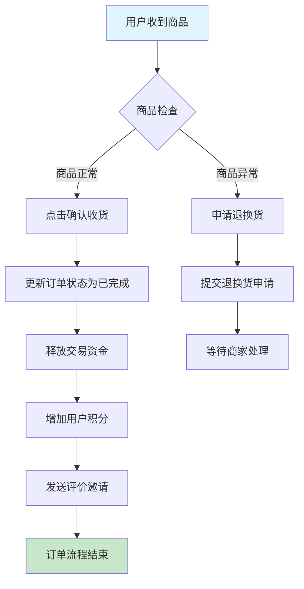

### 自动确认收货

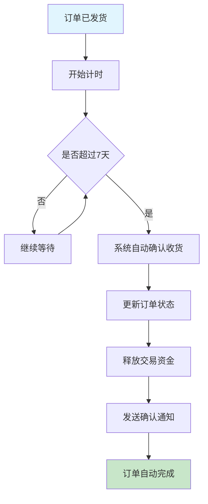

## 订单取消流程

### 取消订单流程图

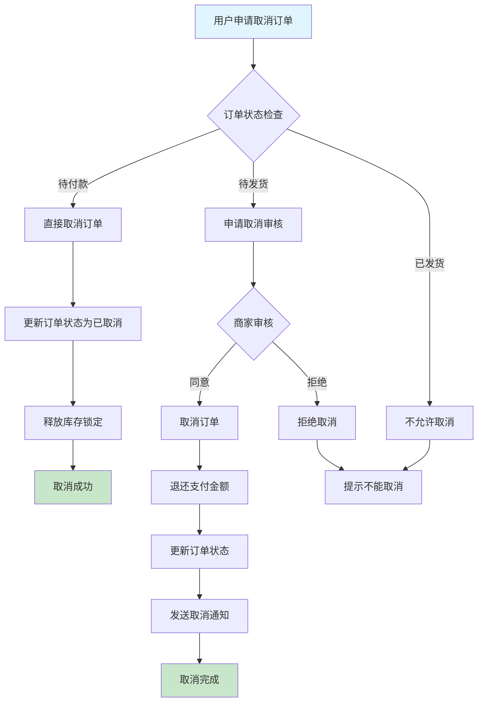

### 超时自动取消

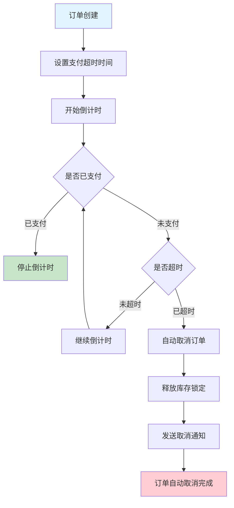

## 退款处理流程

### 退款申请流程

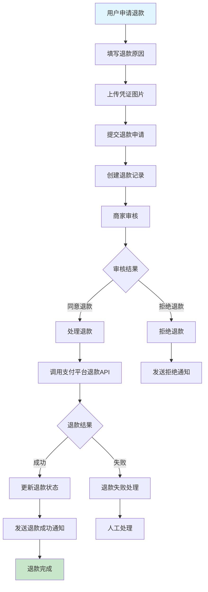

## 订单查询和管理

### 订单列表查询

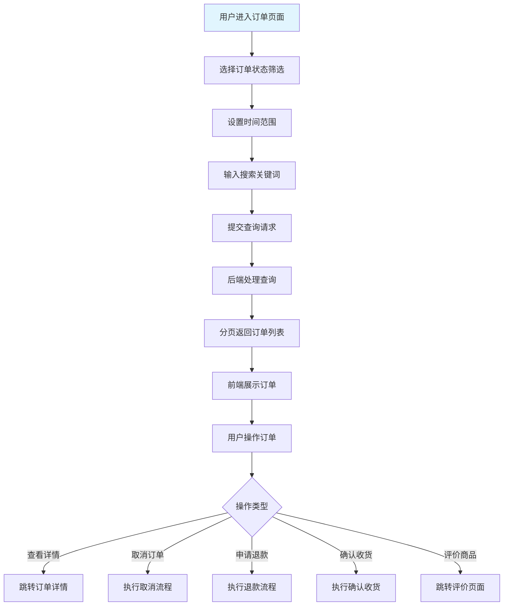

## 业务规则说明

### 订单创建规则
1. **库存检查**: 创建订单前必须检查商品库存
2. **价格锁定**: 订单创建时锁定商品价格
3. **地址验证**: 收货地址必须完整有效
4. **优惠券限制**: 每个订单最多使用一张优惠券
5. **最小金额**: 订单金额不能低于配送费

### 支付规则
1. **支付超时**: 订单创建后30分钟内必须完成支付
2. **重复支付**: 防止订单重复支付
3. **金额验证**: 支付金额必须与订单金额一致
4. **状态检查**: 只有待付款状态的订单才能支付

### 发货规则
1. **发货时限**: 支付成功后48小时内必须发货
2. **物流信息**: 发货时必须填写完整物流信息
3. **状态限制**: 只有待发货状态的订单才能发货
4. **库存扣减**: 发货时扣减实际库存

### 取消规则
1. **取消时限**: 待付款状态可随时取消，待发货状态需商家同意
2. **退款处理**: 已支付订单取消后自动退款
3. **库存恢复**: 取消订单后恢复库存
4. **取消次数**: 限制用户恶意取消订单的次数

### 退款规则
1. **退款时限**: 收货后7天内可申请退款
2. **退款原因**: 必须提供合理的退款原因
3. **商品状态**: 退款商品必须保持原有状态
4. **退款金额**: 退款金额不超过实际支付金额

---
*最后更新时间: 2025-06-18*
*维护者: 青柠檬*
