# 母婴商城支付处理流程

## 概述

本文档详细描述了母婴商城系统的支付处理流程，包括支付宝支付、微信支付、余额支付等多种支付方式的完整业务流程，以及支付回调、退款处理等关键环节。

## 支付状态机

### 支付状态流转图

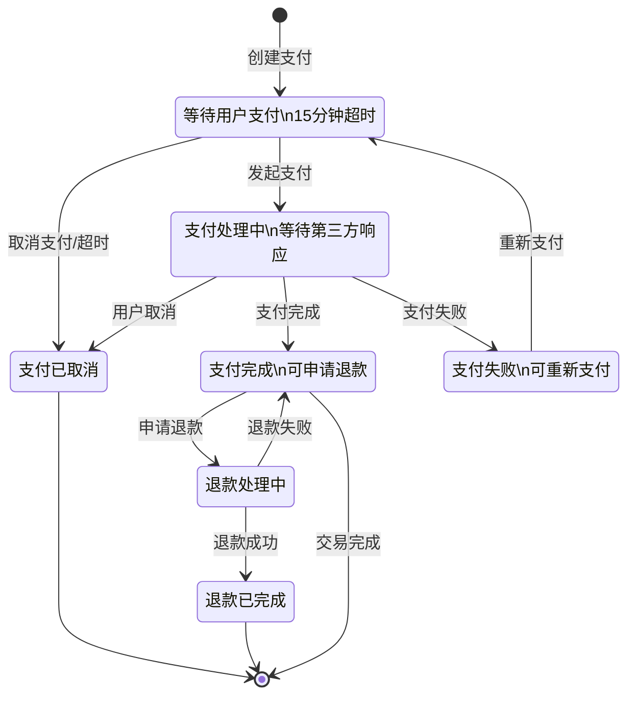

## 支付方式集成

### 支付宝支付流程

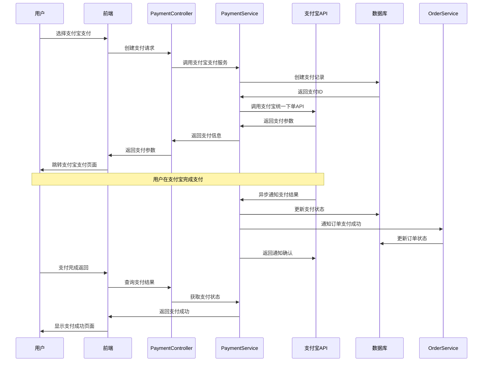

### 微信支付流程

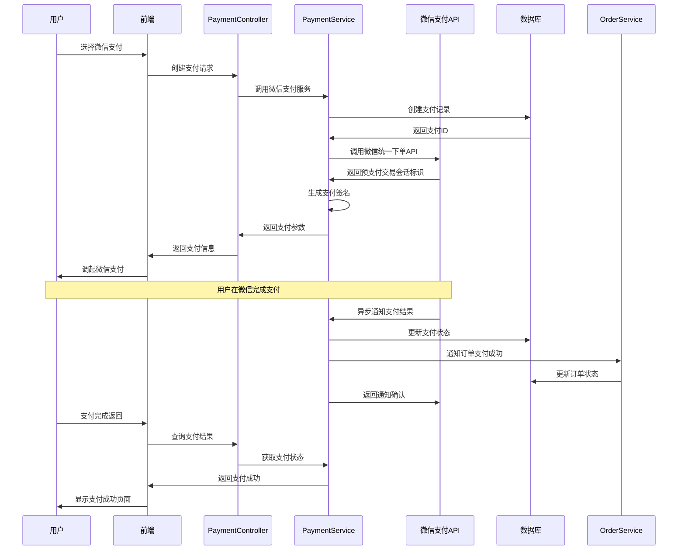

### 余额支付流程

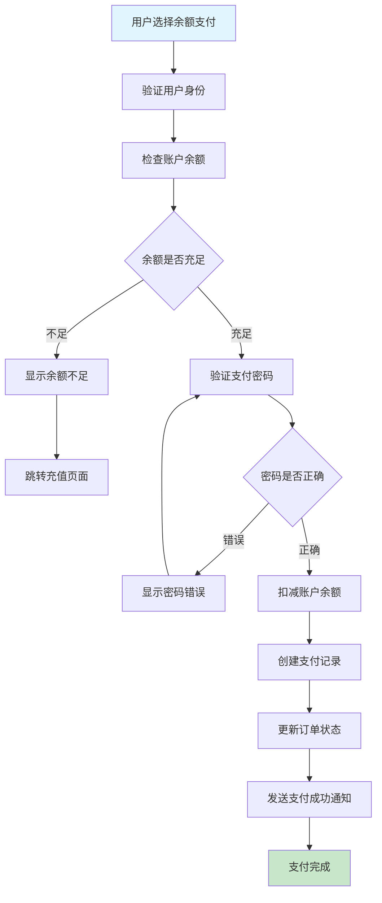

## 支付创建流程

### 支付创建流程图

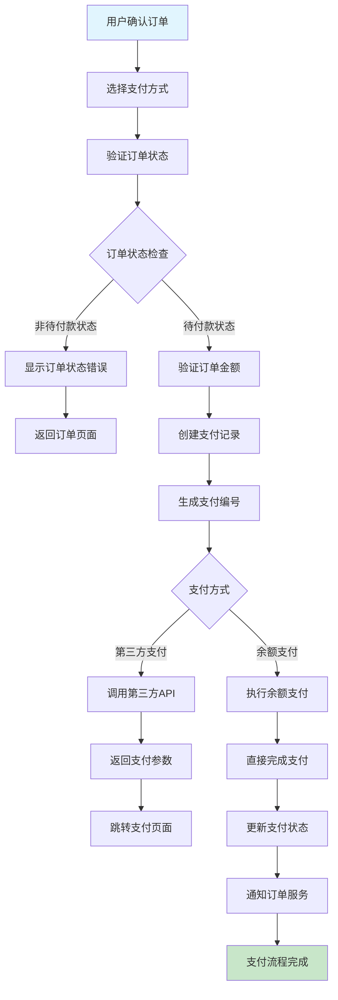

### 支付参数生成

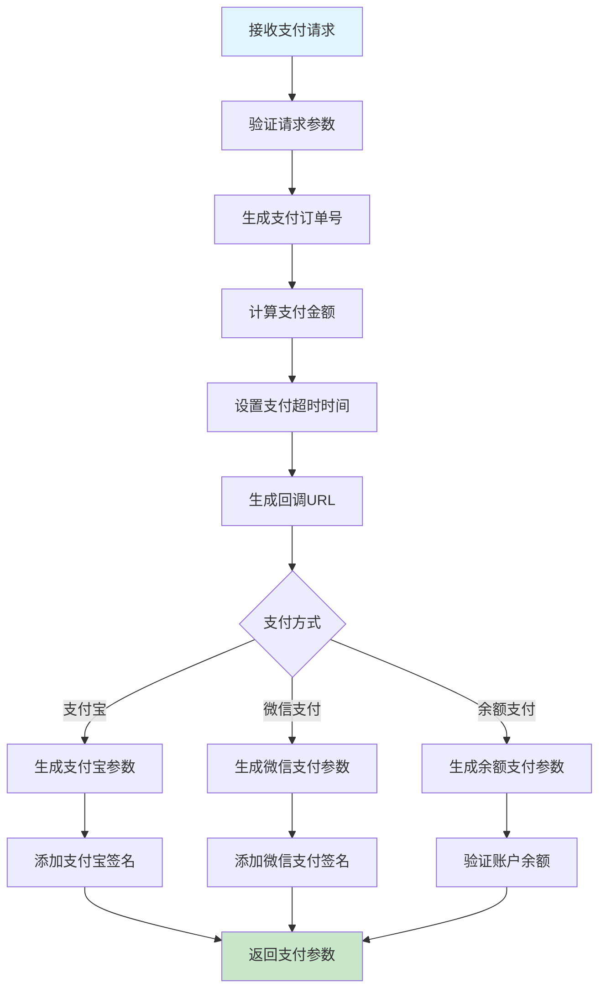

## 支付回调处理

### 异步通知处理流程

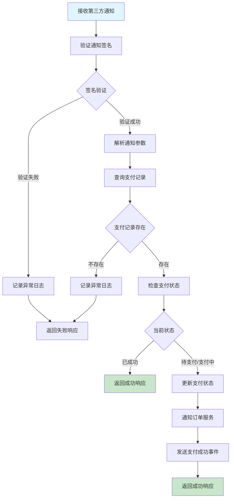

### 支付结果同步查询

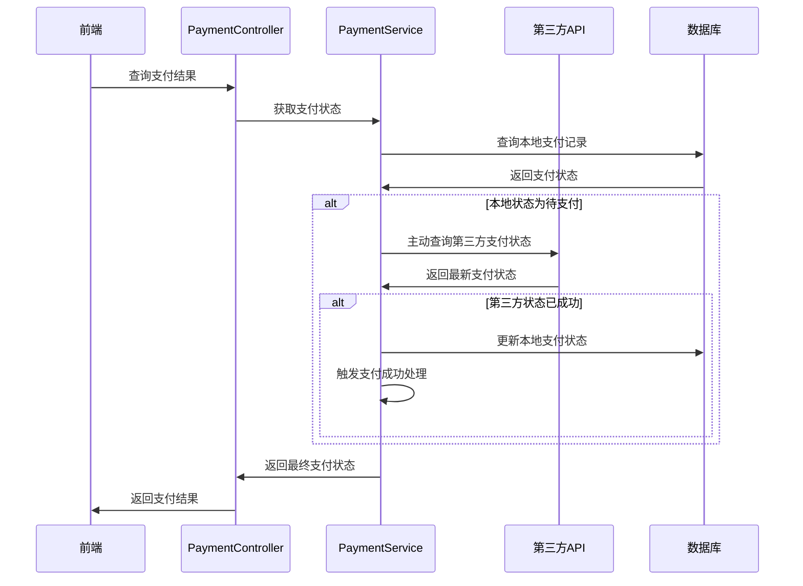

## 退款处理流程

### 退款申请流程

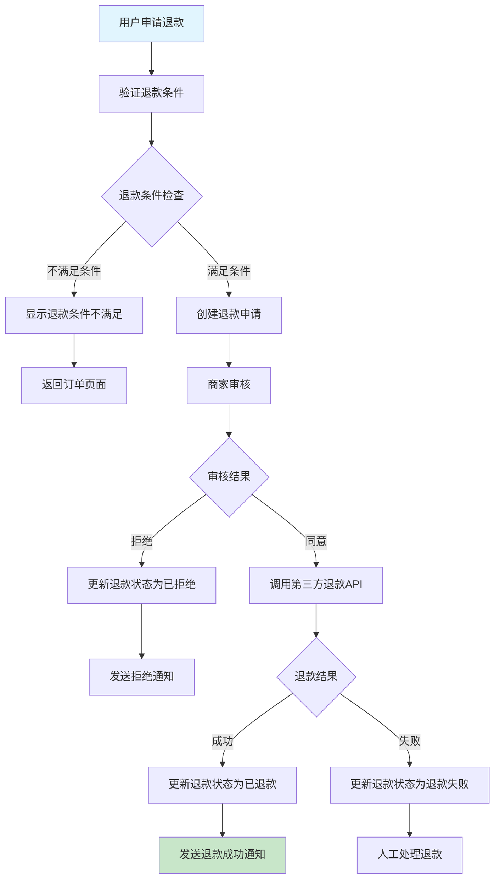

### 退款时序图

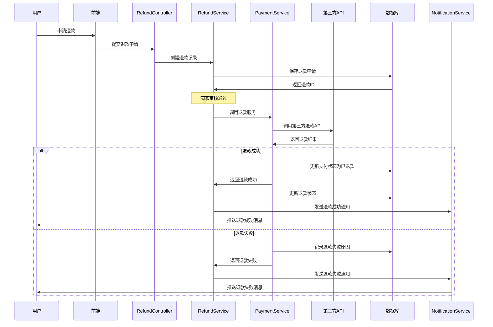

## 支付安全机制

### 防重复支付

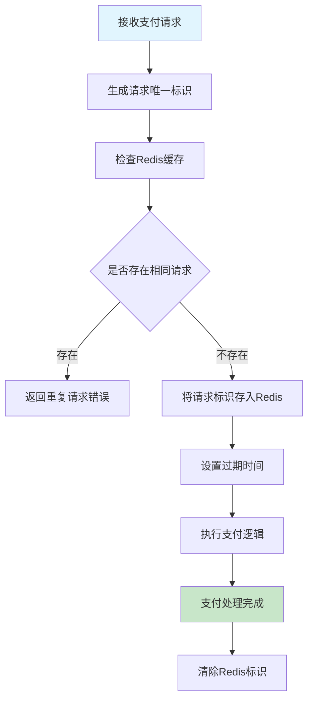

### 支付金额验证

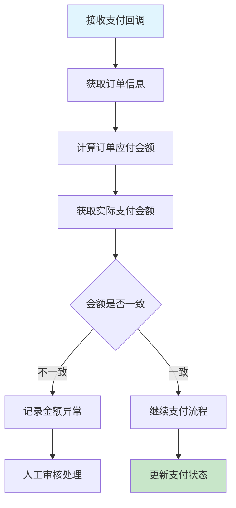

### 签名验证机制

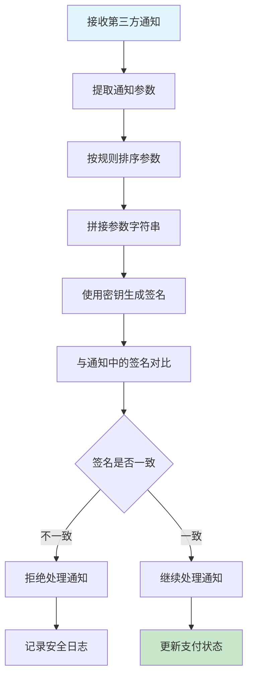

## 支付监控和对账

### 支付状态监控

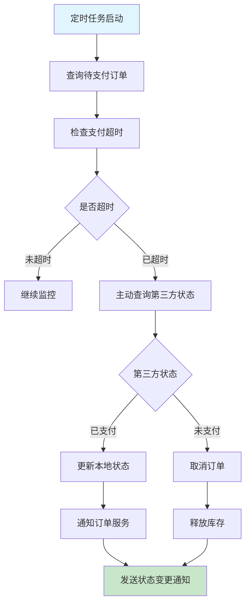

### 对账流程

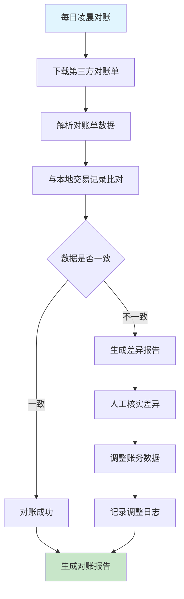

## 业务规则说明

### 支付创建规则
1. **订单状态**: 只有待付款状态的订单才能创建支付
2. **金额验证**: 支付金额必须与订单金额完全一致
3. **支付超时**: 支付创建后15分钟内必须完成支付
4. **重复支付**: 同一订单不能重复创建支付
5. **支付方式**: 根据订单金额限制可用支付方式

### 支付回调规则
1. **签名验证**: 所有回调通知必须验证签名
2. **幂等处理**: 支持重复通知的幂等处理
3. **状态检查**: 只有待支付状态才能更新为成功
4. **异常处理**: 回调处理异常时记录详细日志
5. **响应格式**: 按第三方要求返回标准响应

### 退款规则
1. **退款时限**: 支付成功后180天内可申请退款
2. **退款金额**: 退款金额不能超过原支付金额
3. **退款次数**: 同一笔支付最多申请3次退款
4. **退款状态**: 只有支付成功状态才能申请退款
5. **审核机制**: 大额退款需要人工审核

### 安全规则
1. **防重放**: 使用时间戳和随机数防止重放攻击
2. **IP白名单**: 限制回调通知的来源IP
3. **频率限制**: 限制支付接口的调用频率
4. **敏感信息**: 支付密码等敏感信息加密存储
5. **日志记录**: 记录所有支付相关操作的详细日志

---
*最后更新时间: 2025-06-18*
*维护者: 青柠檬*
