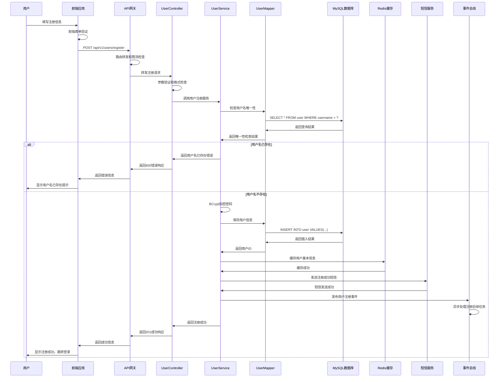
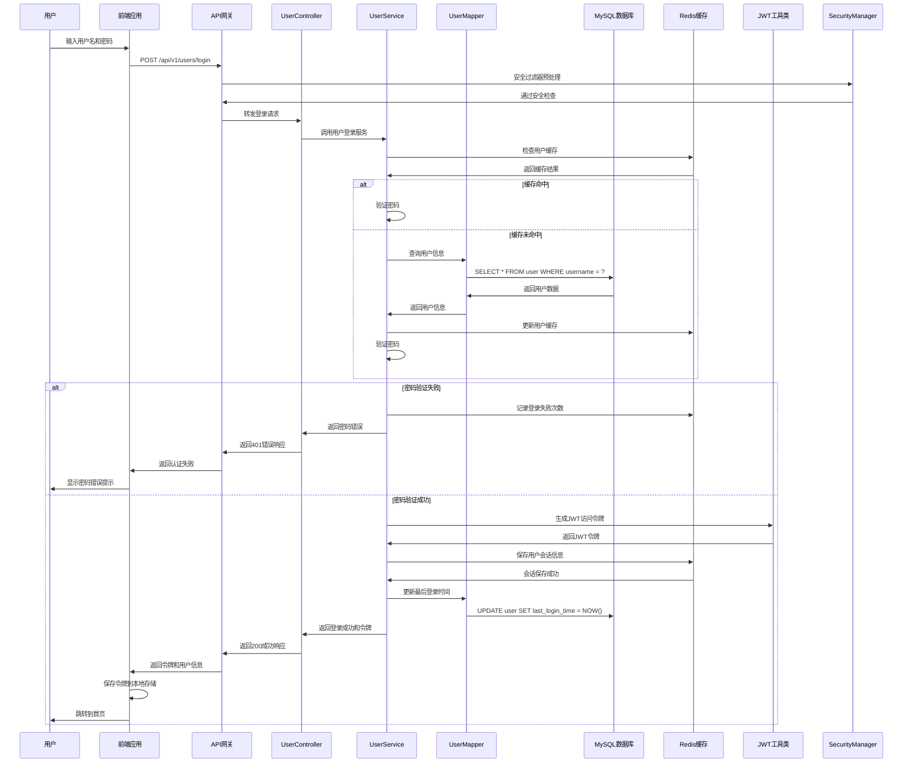
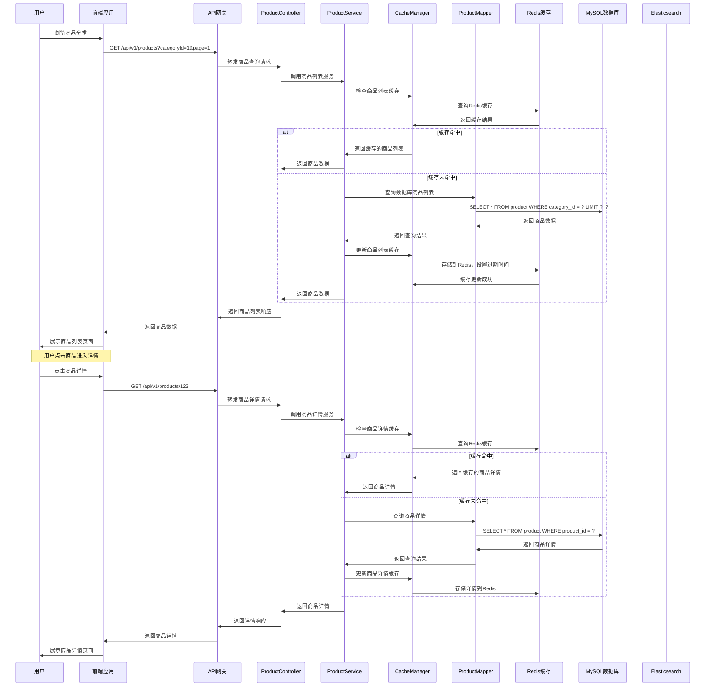
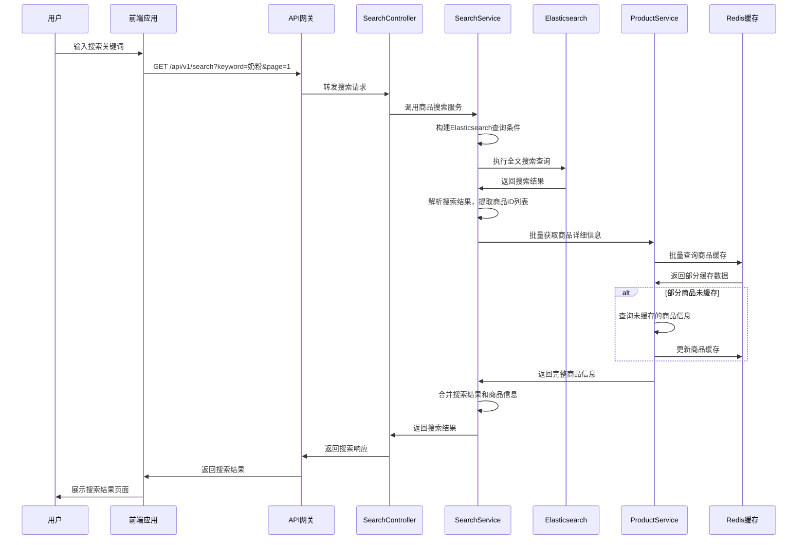
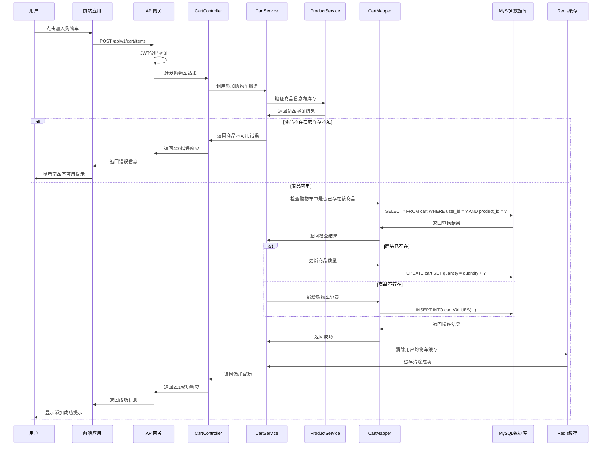
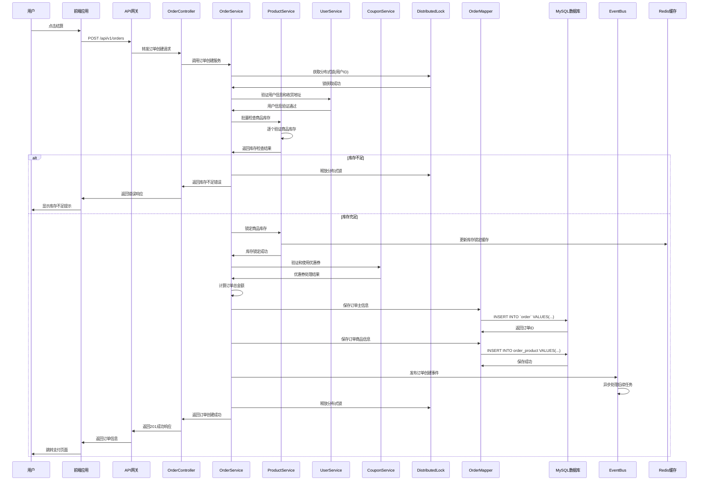
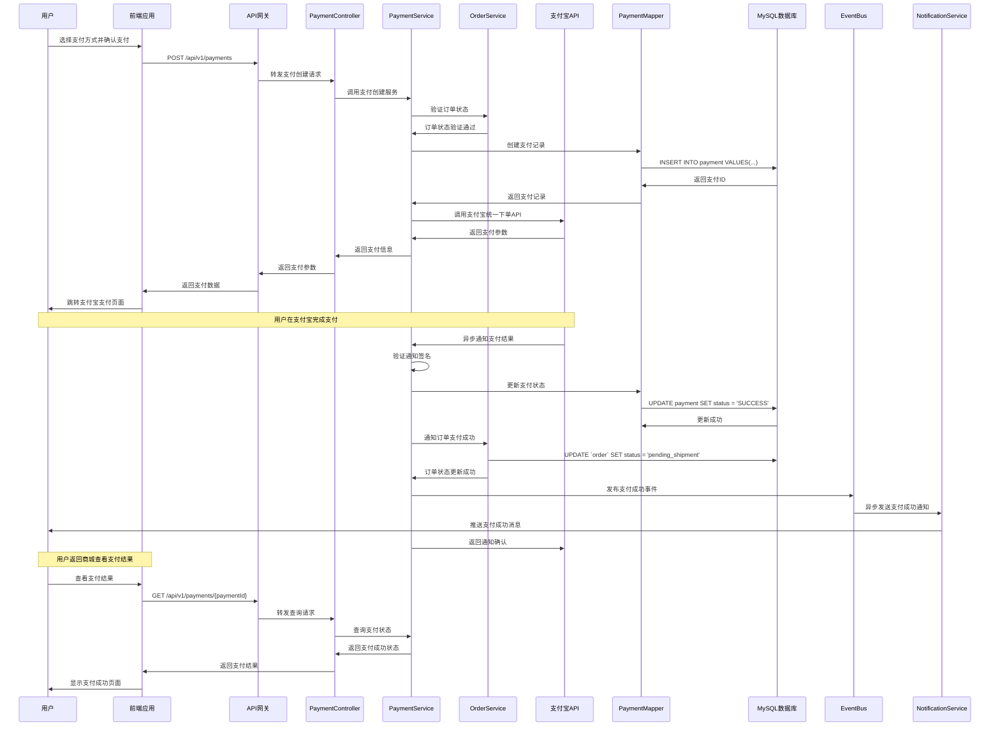

# 母婴商城关键业务时序图

## 概述

本文档展示了母婴商城系统中关键业务场景的时序图，详细描述了各个组件之间的交互时序和数据流向，为系统开发和维护提供参考。

## 用户认证时序图

### 用户注册时序图

### 用户登录时序图

## 商品浏览时序图

### 商品列表查询时序图

### 商品搜索时序图

## 购物车操作时序图

### 添加商品到购物车时序图

## 订单处理时序图

### 订单创建时序图

### 支付处理时序图

---
*最后更新时间: 2025-06-18*
*维护者: 青柠檬*
