# 母婴商城用户业务流程

## 概述

本文档详细描述了母婴商城系统中用户相关的各种业务流程，包括用户注册、登录、信息管理、地址管理等核心用户操作流程。

## 用户注册流程

### 注册流程图

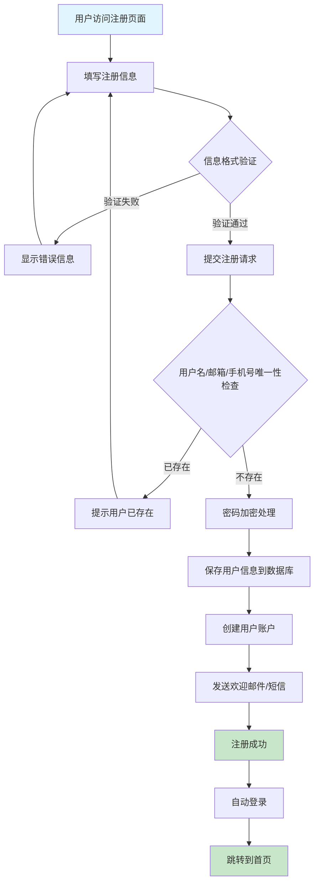

### 注册时序图

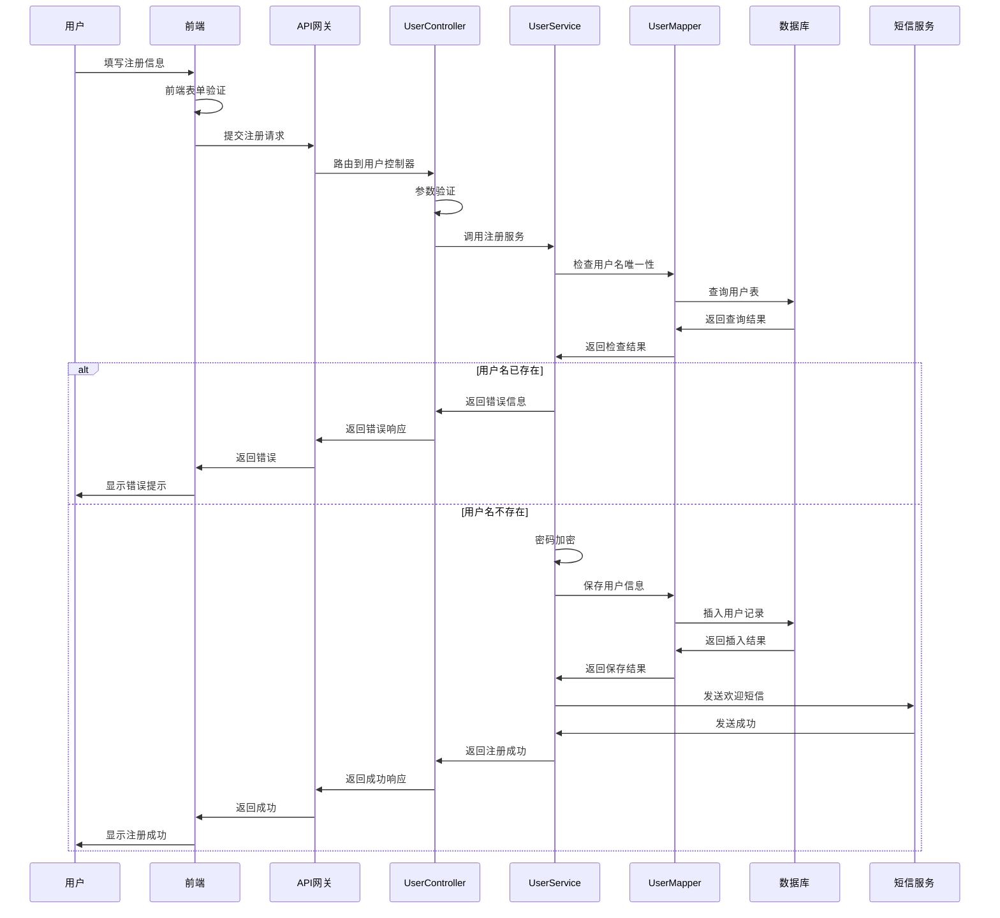

### 注册业务规则

| 字段 | 验证规则 | 错误提示 |
|------|----------|----------|
| 用户名 | 3-20字符，字母数字下划线 | 用户名格式不正确 |
| 密码 | 6-20字符，包含字母和数字 | 密码强度不够 |
| 邮箱 | 标准邮箱格式 | 邮箱格式不正确 |
| 手机号 | 11位数字，1开头 | 手机号格式不正确 |
| 验证码 | 6位数字，5分钟有效 | 验证码错误或已过期 |

## 用户登录流程

### 登录流程图

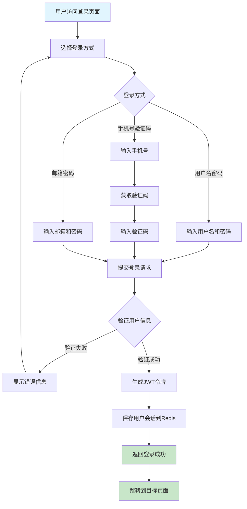

### 登录时序图

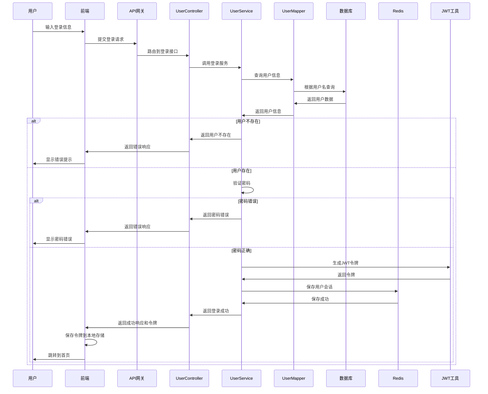

## 用户信息管理流程

### 个人信息修改流程

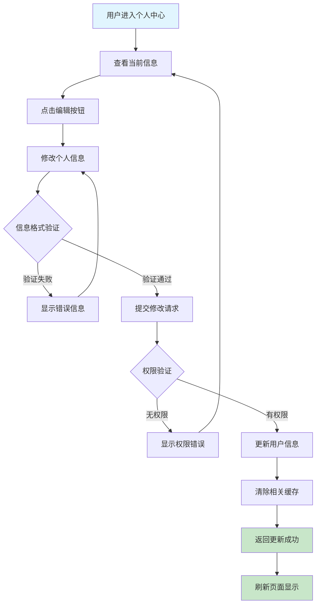

### 头像上传流程

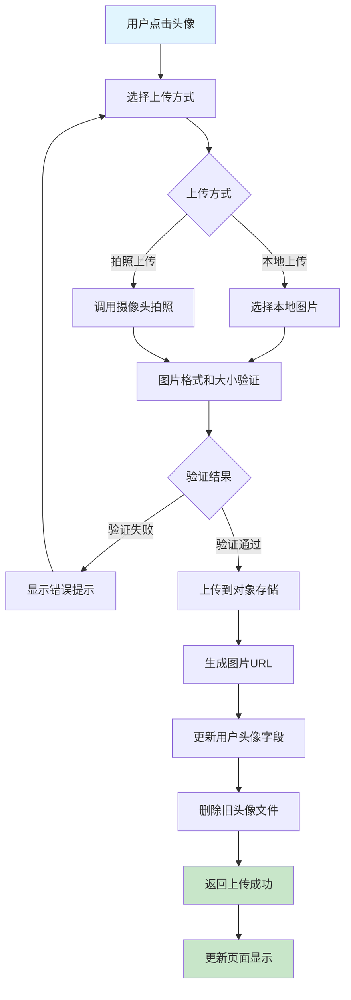

## 收货地址管理流程

### 添加地址流程

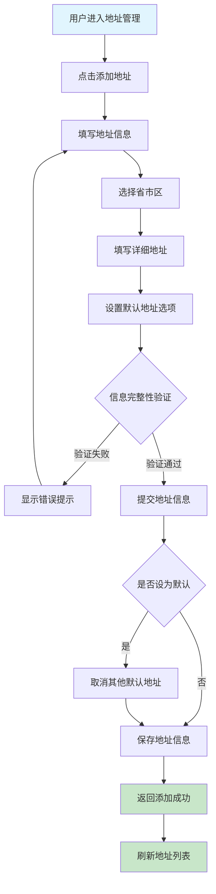

### 地址管理时序图

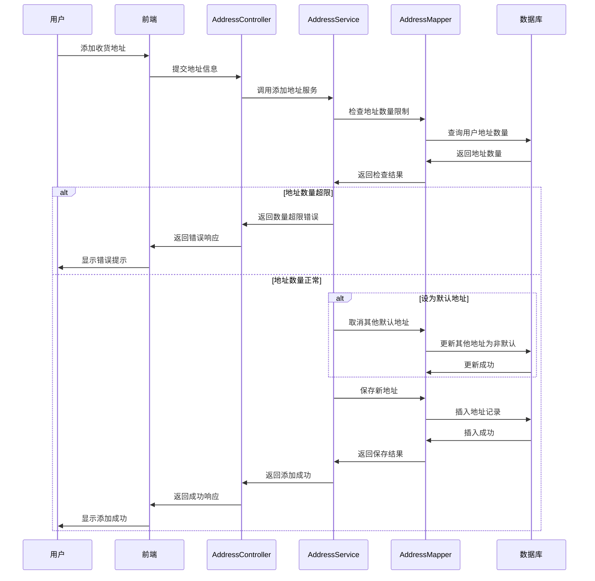

## 密码管理流程

### 修改密码流程

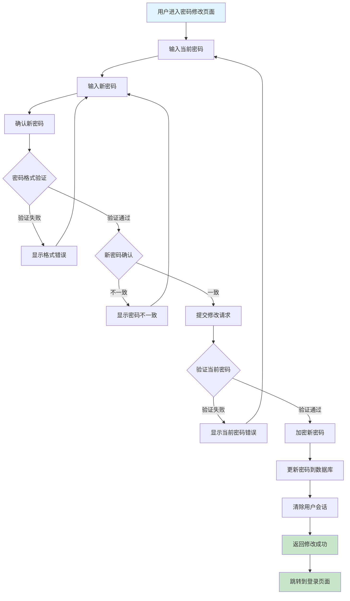

### 忘记密码流程

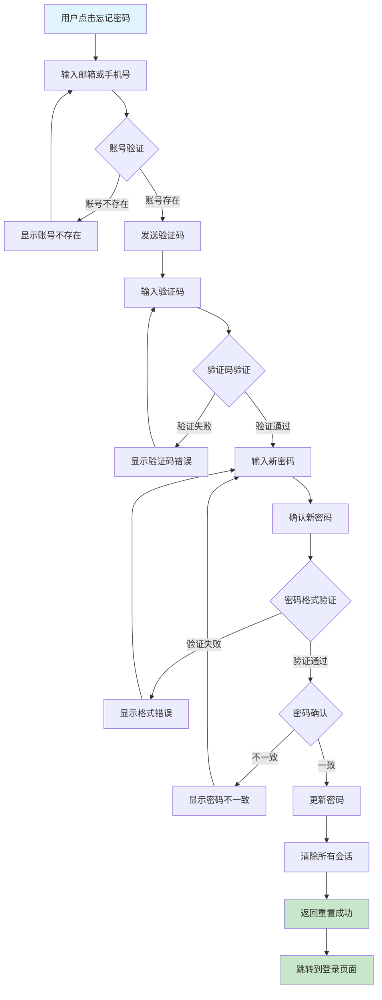

## 用户状态管理

### 用户状态流转图

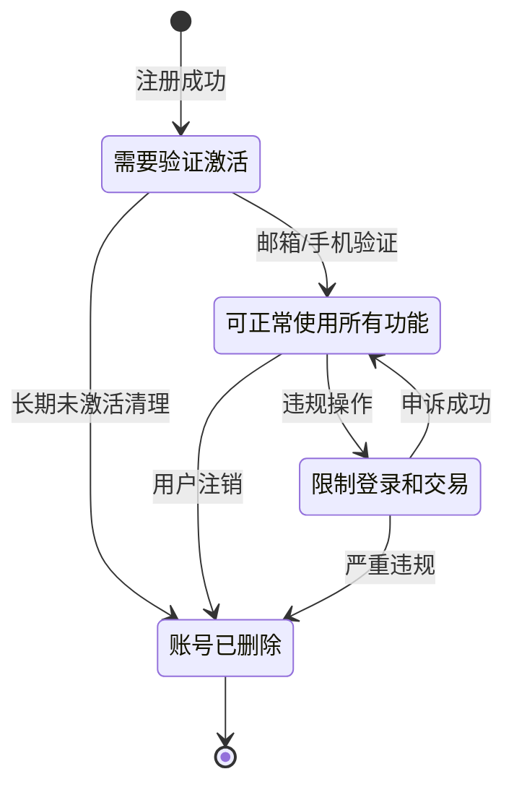

## 业务规则说明

### 用户注册规则
1. **唯一性约束**: 用户名、邮箱、手机号必须唯一
2. **密码强度**: 至少6位，包含字母和数字
3. **验证机制**: 邮箱或手机号验证激活
4. **防刷机制**: 同IP限制注册频率

### 登录安全规则
1. **失败限制**: 连续5次失败锁定30分钟
2. **会话管理**: JWT令牌24小时有效期
3. **设备限制**: 同时最多5个设备登录
4. **异地登录**: 异地登录需要验证

### 信息修改规则
1. **敏感信息**: 手机号、邮箱修改需要验证
2. **修改频率**: 24小时内最多修改3次
3. **审核机制**: 昵称、头像需要审核
4. **日志记录**: 所有修改操作记录日志

### 地址管理规则
1. **数量限制**: 每个用户最多20个收货地址
2. **默认地址**: 只能有一个默认地址
3. **地址验证**: 省市区必须真实有效
4. **删除限制**: 有未完成订单的地址不能删除

---
*最后更新时间: 2025-06-18*
*维护者: 青柠檬*
