# 母婴商城数据库ER图

## 概述

本文档展示了母婴商城系统的数据库实体关系图(Entity Relationship Diagram)，采用Mermaid语法绘制，便于版本控制和维护。

## 完整ER图

```mermaid
erDiagram
    %% 用户域
    USER {
        int user_id PK "用户ID"
        string username "用户名"
        string password "密码"
        string email "邮箱"
        string phone "手机号"
        string avatar "头像"
        string nickname "昵称"
        enum gender "性别"
        date birthday "生日"
        datetime create_time "创建时间"
        datetime update_time "更新时间"
    }
    
    USER_ADDRESS {
        int address_id PK "地址ID"
        int user_id FK "用户ID"
        string receiver_name "收货人姓名"
        string receiver_phone "收货人电话"
        string province "省份"
        string city "城市"
        string district "区县"
        string detail_address "详细地址"
        boolean is_default "是否默认"
        datetime create_time "创建时间"
    }
    
    USER_ACCOUNT {
        int account_id PK "账户ID"
        int user_id FK "用户ID"
        decimal balance "账户余额"
        decimal frozen_balance "冻结余额"
        int points "积分"
        int status "账户状态"
        string pay_password "支付密码"
        datetime create_time "创建时间"
    }
    
    %% 商品域
    CATEGORY {
        int category_id PK "分类ID"
        int parent_id "父分类ID"
        string name "分类名称"
        string icon "分类图标"
        int sort_order "排序"
        int status "状态"
        datetime create_time "创建时间"
    }
    
    BRAND {
        int brand_id PK "品牌ID"
        string name "品牌名称"
        string logo "品牌logo"
        text description "品牌描述"
        int sort_order "排序"
        int status "状态"
        datetime create_time "创建时间"
    }
    
    PRODUCT {
        int product_id PK "商品ID"
        int category_id FK "分类ID"
        int brand_id FK "品牌ID"
        string product_name "商品名称"
        string product_sn "商品编号"
        string product_img "商品主图"
        text product_detail "商品详情"
        decimal price_new "现价"
        decimal price_old "原价"
        int stock "库存"
        int sales "销量"
        decimal rating "评分"
        int review_count "评价数量"
        enum product_status "商品状态"
        boolean is_hot "是否热门"
        boolean is_new "是否新品"
        boolean is_recommend "是否推荐"
        datetime create_time "创建时间"
    }
    
    PRODUCT_IMAGE {
        int image_id PK "图片ID"
        int product_id FK "商品ID"
        string image_url "图片URL"
        enum type "图片类型"
        int sort_order "排序"
        datetime create_time "创建时间"
    }
    
    PRODUCT_SPECS {
        int spec_id PK "规格ID"
        int product_id FK "商品ID"
        string spec_name "规格名称"
        json spec_values "规格值列表"
        int sort_order "排序"
        datetime create_time "创建时间"
    }
    
    %% 订单域
    ORDER {
        int order_id PK "订单ID"
        string order_no "订单编号"
        int user_id FK "用户ID"
        decimal total_amount "订单总金额"
        decimal actual_amount "实付金额"
        enum status "订单状态"
        long payment_id FK "支付ID"
        datetime pay_time "支付时间"
        string receiver_name "收货人姓名"
        string receiver_phone "收货人电话"
        string receiver_address "收货地址"
        text remark "备注"
        datetime create_time "创建时间"
    }
    
    ORDER_PRODUCT {
        int id PK "ID"
        int order_id FK "订单ID"
        int product_id FK "商品ID"
        string product_name "商品名称"
        string product_img "商品图片"
        decimal price "商品价格"
        int quantity "购买数量"
        json specs "规格信息"
        datetime create_time "创建时间"
    }
    
    PAYMENT {
        long payment_id PK "支付ID"
        string payment_no "支付编号"
        int order_id FK "订单ID"
        int user_id FK "用户ID"
        decimal amount "支付金额"
        enum payment_method "支付方式"
        enum status "支付状态"
        string transaction_id "第三方交易号"
        datetime pay_time "支付时间"
        datetime create_time "创建时间"
    }
    
    %% 购物车域
    CART {
        int cart_id PK "购物车ID"
        int user_id FK "用户ID"
        int product_id FK "商品ID"
        int quantity "数量"
        boolean selected "是否选中"
        json specs "规格信息"
        string specs_hash "规格哈希值"
        decimal price_snapshot "价格快照"
        int status "状态"
        datetime create_time "创建时间"
    }
    
    %% 营销域
    COUPON {
        long id PK "优惠券ID"
        string name "优惠券名称"
        enum type "优惠券类型"
        decimal value "优惠券面值"
        decimal min_spend "最低消费金额"
        decimal max_discount "最大折扣金额"
        enum status "状态"
        int total_quantity "发行总量"
        int used_quantity "已使用数量"
        datetime start_time "有效期开始"
        datetime end_time "有效期结束"
        datetime create_time "创建时间"
    }
    
    USER_COUPON {
        long id PK "用户优惠券ID"
        int user_id FK "用户ID"
        long coupon_id FK "优惠券ID"
        enum status "使用状态"
        datetime receive_time "领取时间"
        datetime use_time "使用时间"
        datetime expire_time "过期时间"
    }
    
    COMMENT {
        int comment_id PK "评价ID"
        int user_id FK "用户ID"
        int product_id FK "商品ID"
        int order_id FK "订单ID"
        text content "评价内容"
        int rating "评分"
        json images "评价图片"
        boolean is_anonymous "是否匿名"
        int status "状态"
        datetime create_time "创建时间"
    }
    
    %% 物流域
    LOGISTICS_COMPANY {
        int id PK "物流公司ID"
        string code "公司代码"
        string name "公司名称"
        string contact "联系人"
        string phone "联系电话"
        string address "公司地址"
        int status "状态"
        datetime create_time "创建时间"
    }
    
    LOGISTICS {
        long id PK "物流ID"
        int order_id FK "订单ID"
        int company_id FK "物流公司ID"
        string tracking_no "物流单号"
        enum status "物流状态"
        string sender_name "发件人姓名"
        string sender_phone "发件人电话"
        string receiver_name "收件人姓名"
        string receiver_phone "收件人电话"
        datetime create_time "创建时间"
    }
    
    %% 关系定义
    USER ||--o{ USER_ADDRESS : "拥有"
    USER ||--|| USER_ACCOUNT : "拥有"
    USER ||--o{ CART : "拥有"
    USER ||--o{ ORDER : "下单"
    USER ||--o{ USER_COUPON : "领取"
    USER ||--o{ COMMENT : "评价"
    
    CATEGORY ||--o{ PRODUCT : "包含"
    BRAND ||--o{ PRODUCT : "属于"
    PRODUCT ||--o{ PRODUCT_IMAGE : "拥有"
    PRODUCT ||--o{ PRODUCT_SPECS : "拥有"
    PRODUCT ||--o{ CART : "加入"
    PRODUCT ||--o{ ORDER_PRODUCT : "包含"
    PRODUCT ||--o{ COMMENT : "被评价"
    
    ORDER ||--o{ ORDER_PRODUCT : "包含"
    ORDER ||--|| PAYMENT : "支付"
    ORDER ||--|| LOGISTICS : "配送"
    
    COUPON ||--o{ USER_COUPON : "发放"
    
    LOGISTICS_COMPANY ||--o{ LOGISTICS : "承运"
```

## 业务域说明

### 1. 用户域 (User Domain)
- **核心实体**: USER（用户）
- **关联实体**: USER_ADDRESS（用户地址）、USER_ACCOUNT（用户账户）
- **业务特点**: 支持多地址管理、积分账户体系

### 2. 商品域 (Product Domain)  
- **核心实体**: PRODUCT（商品）
- **关联实体**: CATEGORY（分类）、BRAND（品牌）、PRODUCT_IMAGE（商品图片）、PRODUCT_SPECS（商品规格）
- **业务特点**: 支持多级分类、多规格商品、多图片展示

### 3. 订单域 (Order Domain)
- **核心实体**: ORDER（订单）
- **关联实体**: ORDER_PRODUCT（订单商品）、PAYMENT（支付）
- **业务特点**: 支持多商品订单、多种支付方式

### 4. 购物车域 (Cart Domain)
- **核心实体**: CART（购物车）
- **业务特点**: 支持规格选择、批量操作

### 5. 营销域 (Marketing Domain)
- **核心实体**: COUPON（优惠券）、USER_COUPON（用户优惠券）、COMMENT（评价）
- **业务特点**: 支持多种优惠券类型、用户评价体系

### 6. 物流域 (Logistics Domain)
- **核心实体**: LOGISTICS（物流）、LOGISTICS_COMPANY（物流公司）
- **业务特点**: 支持多物流公司、物流跟踪

## 关键设计特点

1. **模块化设计**: 按业务域划分，便于维护和扩展
2. **规范化设计**: 遵循第三范式，减少数据冗余
3. **扩展性设计**: 预留扩展字段，支持业务发展
4. **性能优化**: 合理设计索引，支持高并发查询
5. **数据完整性**: 通过外键约束保证数据一致性

---
*最后更新时间: 2025-06-18*
*维护者: 青柠檬*
