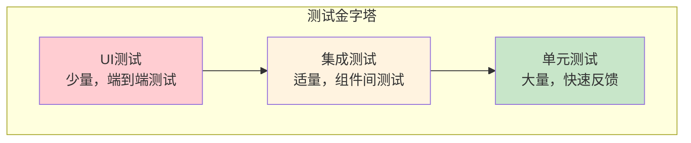

# 母婴商城测试指南

## 概述

本文档详细介绍了母婴商城系统的测试策略、测试方法和最佳实践，包括单元测试、集成测试、API测试等各个层面的测试指导。

## 测试策略

### 测试金字塔



### 测试分层策略

| 测试层级 | 测试范围 | 测试工具 | 覆盖率目标 |
|----------|----------|----------|------------|
| 单元测试 | 方法、类 | JUnit 5, Mockito | 80%+ |
| 集成测试 | 组件交互 | Spring Boot Test | 60%+ |
| API测试 | 接口功能 | RestAssured, Postman | 90%+ |
| 端到端测试 | 完整流程 | Selenium, Cypress | 关键路径 |

## 单元测试

### 1. 测试环境配置

#### Maven依赖配置
```xml
<dependencies>
    <!-- Spring Boot Test Starter -->
    <dependency>
        <groupId>org.springframework.boot</groupId>
        <artifactId>spring-boot-starter-test</artifactId>
        <scope>test</scope>
    </dependency>
    
    <!-- Testcontainers -->
    <dependency>
        <groupId>org.testcontainers</groupId>
        <artifactId>junit-jupiter</artifactId>
        <scope>test</scope>
    </dependency>
    
    <dependency>
        <groupId>org.testcontainers</groupId>
        <artifactId>mysql</artifactId>
        <scope>test</scope>
    </dependency>
    
    <!-- WireMock -->
    <dependency>
        <groupId>com.github.tomakehurst</groupId>
        <artifactId>wiremock-jre8</artifactId>
        <scope>test</scope>
    </dependency>
</dependencies>
```

#### 测试配置文件
```yaml
# application-test.yml
spring:
  datasource:
    url: jdbc:h2:mem:testdb
    driver-class-name: org.h2.Driver
    username: sa
    password: 
  
  jpa:
    hibernate:
      ddl-auto: create-drop
    show-sql: true
  
  redis:
    host: localhost
    port: 6379
    database: 1

logging:
  level:
    com.muyingmall: DEBUG
    org.springframework.web: DEBUG
```

### 2. Service层单元测试

#### UserService测试示例
```java
@ExtendWith(MockitoExtension.class)
class UserServiceTest {
    
    @Mock
    private UserMapper userMapper;
    
    @Mock
    private RedisTemplate<String, Object> redisTemplate;
    
    @Mock
    private PasswordEncoder passwordEncoder;
    
    @InjectMocks
    private UserService userService;
    
    @Test
    @DisplayName("根据ID获取用户 - 成功")
    void getUserById_Success() {
        // Given
        Integer userId = 1;
        User expectedUser = User.builder()
                .userId(userId)
                .username("testuser")
                .email("test@example.com")
                .build();
        
        when(userMapper.selectById(userId)).thenReturn(expectedUser);
        
        // When
        User actualUser = userService.getUserById(userId);
        
        // Then
        assertThat(actualUser).isNotNull();
        assertThat(actualUser.getUserId()).isEqualTo(userId);
        assertThat(actualUser.getUsername()).isEqualTo("testuser");
        
        verify(userMapper).selectById(userId);
    }
    
    @Test
    @DisplayName("根据ID获取用户 - 用户不存在")
    void getUserById_UserNotFound() {
        // Given
        Integer userId = 999;
        when(userMapper.selectById(userId)).thenReturn(null);
        
        // When & Then
        assertThatThrownBy(() -> userService.getUserById(userId))
                .isInstanceOf(UserNotFoundException.class)
                .hasMessage("用户不存在");
        
        verify(userMapper).selectById(userId);
    }
    
    @Test
    @DisplayName("创建用户 - 成功")
    void createUser_Success() {
        // Given
        UserCreateRequest request = UserCreateRequest.builder()
                .username("newuser")
                .password("password123")
                .email("newuser@example.com")
                .build();
        
        User savedUser = User.builder()
                .userId(1)
                .username("newuser")
                .email("newuser@example.com")
                .build();
        
        when(userMapper.selectByUsername("newuser")).thenReturn(null);
        when(passwordEncoder.encode("password123")).thenReturn("encodedPassword");
        when(userMapper.insert(any(User.class))).thenReturn(1);
        when(userMapper.selectById(any())).thenReturn(savedUser);
        
        // When
        User result = userService.createUser(request);
        
        // Then
        assertThat(result).isNotNull();
        assertThat(result.getUsername()).isEqualTo("newuser");
        
        verify(userMapper).selectByUsername("newuser");
        verify(passwordEncoder).encode("password123");
        verify(userMapper).insert(any(User.class));
    }
    
    @ParameterizedTest
    @DisplayName("用户名验证测试")
    @ValueSource(strings = {"", "ab", "verylongusernamethatexceedslimit"})
    void validateUsername_InvalidUsernames(String username) {
        // Given
        UserCreateRequest request = UserCreateRequest.builder()
                .username(username)
                .password("password123")
                .email("test@example.com")
                .build();
        
        // When & Then
        assertThatThrownBy(() -> userService.createUser(request))
                .isInstanceOf(ValidationException.class);
    }
}
```

### 3. Controller层单元测试

#### UserController测试示例
```java
@WebMvcTest(UserController.class)
class UserControllerTest {
    
    @Autowired
    private MockMvc mockMvc;
    
    @MockBean
    private UserService userService;
    
    @Autowired
    private ObjectMapper objectMapper;
    
    @Test
    @DisplayName("获取用户信息 - 成功")
    void getUserById_Success() throws Exception {
        // Given
        Integer userId = 1;
        User user = User.builder()
                .userId(userId)
                .username("testuser")
                .email("test@example.com")
                .build();
        
        when(userService.getUserById(userId)).thenReturn(user);
        
        // When & Then
        mockMvc.perform(get("/api/v1/users/{userId}", userId)
                        .contentType(MediaType.APPLICATION_JSON))
                .andExpect(status().isOk())
                .andExpect(jsonPath("$.code").value(200))
                .andExpect(jsonPath("$.data.userId").value(userId))
                .andExpect(jsonPath("$.data.username").value("testuser"))
                .andDo(print());
        
        verify(userService).getUserById(userId);
    }
    
    @Test
    @DisplayName("创建用户 - 成功")
    void createUser_Success() throws Exception {
        // Given
        UserCreateRequest request = UserCreateRequest.builder()
                .username("newuser")
                .password("password123")
                .email("newuser@example.com")
                .phone("13800138000")
                .build();
        
        User createdUser = User.builder()
                .userId(1)
                .username("newuser")
                .email("newuser@example.com")
                .build();
        
        when(userService.createUser(any(UserCreateRequest.class))).thenReturn(createdUser);
        
        // When & Then
        mockMvc.perform(post("/api/v1/users")
                        .contentType(MediaType.APPLICATION_JSON)
                        .content(objectMapper.writeValueAsString(request)))
                .andExpect(status().isCreated())
                .andExpect(jsonPath("$.code").value(201))
                .andExpect(jsonPath("$.data.username").value("newuser"))
                .andDo(print());
        
        verify(userService).createUser(any(UserCreateRequest.class));
    }
    
    @Test
    @DisplayName("创建用户 - 参数验证失败")
    void createUser_ValidationFailed() throws Exception {
        // Given
        UserCreateRequest request = UserCreateRequest.builder()
                .username("") // 空用户名
                .password("123") // 密码太短
                .email("invalid-email") // 无效邮箱
                .build();
        
        // When & Then
        mockMvc.perform(post("/api/v1/users")
                        .contentType(MediaType.APPLICATION_JSON)
                        .content(objectMapper.writeValueAsString(request)))
                .andExpect(status().isBadRequest())
                .andExpect(jsonPath("$.code").value(400))
                .andDo(print());
        
        verifyNoInteractions(userService);
    }
}
```

## 集成测试

### 1. 数据库集成测试

#### 使用Testcontainers
```java
@SpringBootTest
@Testcontainers
@Transactional
class UserServiceIntegrationTest {
    
    @Container
    static MySQLContainer<?> mysql = new MySQLContainer<>("mysql:8.0")
            .withDatabaseName("testdb")
            .withUsername("test")
            .withPassword("test");
    
    @Autowired
    private UserService userService;
    
    @Autowired
    private UserMapper userMapper;
    
    @DynamicPropertySource
    static void configureProperties(DynamicPropertyRegistry registry) {
        registry.add("spring.datasource.url", mysql::getJdbcUrl);
        registry.add("spring.datasource.username", mysql::getUsername);
        registry.add("spring.datasource.password", mysql::getPassword);
    }
    
    @Test
    @DisplayName("用户完整流程测试")
    void userCompleteFlow() {
        // Given
        UserCreateRequest request = UserCreateRequest.builder()
                .username("integrationtest")
                .password("password123")
                .email("integration@test.com")
                .phone("13800138000")
                .build();
        
        // When - 创建用户
        User createdUser = userService.createUser(request);
        
        // Then - 验证创建结果
        assertThat(createdUser).isNotNull();
        assertThat(createdUser.getUserId()).isNotNull();
        assertThat(createdUser.getUsername()).isEqualTo("integrationtest");
        
        // When - 查询用户
        User foundUser = userService.getUserById(createdUser.getUserId());
        
        // Then - 验证查询结果
        assertThat(foundUser).isNotNull();
        assertThat(foundUser.getUsername()).isEqualTo("integrationtest");
        assertThat(foundUser.getEmail()).isEqualTo("integration@test.com");
        
        // When - 更新用户
        foundUser.setNickname("Integration Test User");
        userService.updateUser(foundUser);
        
        // Then - 验证更新结果
        User updatedUser = userService.getUserById(createdUser.getUserId());
        assertThat(updatedUser.getNickname()).isEqualTo("Integration Test User");
    }
}
```

### 2. Redis集成测试

```java
@SpringBootTest
@TestPropertySource(properties = {
    "spring.redis.host=localhost",
    "spring.redis.port=6379",
    "spring.redis.database=1"
})
class CacheIntegrationTest {
    
    @Autowired
    private UserService userService;
    
    @Autowired
    private RedisTemplate<String, Object> redisTemplate;
    
    @Test
    @DisplayName("用户缓存测试")
    void userCacheTest() {
        // Given
        Integer userId = 1;
        String cacheKey = "users::" + userId;
        
        // 清除缓存
        redisTemplate.delete(cacheKey);
        
        // When - 第一次查询（从数据库）
        User user1 = userService.getUserById(userId);
        
        // Then - 验证缓存存在
        assertThat(redisTemplate.hasKey(cacheKey)).isTrue();
        
        // When - 第二次查询（从缓存）
        User user2 = userService.getUserById(userId);
        
        // Then - 验证结果一致
        assertThat(user1).isEqualTo(user2);
    }
}
```

## API测试

### 1. REST API测试

#### 使用RestAssured
```java
@SpringBootTest(webEnvironment = SpringBootTest.WebEnvironment.RANDOM_PORT)
class UserApiTest {
    
    @LocalServerPort
    private int port;
    
    @Autowired
    private TestRestTemplate restTemplate;
    
    private String baseUrl;
    
    @BeforeEach
    void setUp() {
        baseUrl = "http://localhost:" + port + "/api/v1";
        RestAssured.port = port;
    }
    
    @Test
    @DisplayName("用户注册API测试")
    void userRegistrationApiTest() {
        // Given
        UserCreateRequest request = UserCreateRequest.builder()
                .username("apitest")
                .password("password123")
                .email("apitest@example.com")
                .phone("13800138000")
                .build();
        
        // When & Then
        given()
            .contentType(ContentType.JSON)
            .body(request)
        .when()
            .post("/api/v1/users")
        .then()
            .statusCode(201)
            .body("code", equalTo(201))
            .body("data.username", equalTo("apitest"))
            .body("data.email", equalTo("apitest@example.com"));
    }
    
    @Test
    @DisplayName("用户登录API测试")
    void userLoginApiTest() {
        // Given - 先创建用户
        UserCreateRequest createRequest = UserCreateRequest.builder()
                .username("logintest")
                .password("password123")
                .email("logintest@example.com")
                .build();
        
        restTemplate.postForEntity(baseUrl + "/users", createRequest, ApiResponse.class);
        
        // Given - 登录请求
        UserLoginRequest loginRequest = UserLoginRequest.builder()
                .username("logintest")
                .password("password123")
                .build();
        
        // When & Then
        given()
            .contentType(ContentType.JSON)
            .body(loginRequest)
        .when()
            .post("/api/v1/auth/login")
        .then()
            .statusCode(200)
            .body("code", equalTo(200))
            .body("data.token", notNullValue())
            .body("data.user.username", equalTo("logintest"));
    }
}
```

### 2. 性能测试

#### JMeter测试脚本示例
```xml
<?xml version="1.0" encoding="UTF-8"?>
<jmeterTestPlan version="1.2">
  <hashTree>
    <TestPlan guiclass="TestPlanGui" testclass="TestPlan" testname="母婴商城API性能测试">
      <elementProp name="TestPlan.arguments" elementType="Arguments" guiclass="ArgumentsPanel">
        <collectionProp name="Arguments.arguments"/>
      </elementProp>
      <stringProp name="TestPlan.user_define_classpath"></stringProp>
      <boolProp name="TestPlan.serialize_threadgroups">false</boolProp>
      <boolProp name="TestPlan.functional_mode">false</boolProp>
    </TestPlan>
    
    <hashTree>
      <ThreadGroup guiclass="ThreadGroupGui" testclass="ThreadGroup" testname="用户API测试组">
        <stringProp name="ThreadGroup.on_sample_error">continue</stringProp>
        <elementProp name="ThreadGroup.main_controller" elementType="LoopController">
          <boolProp name="LoopController.continue_forever">false</boolProp>
          <stringProp name="LoopController.loops">100</stringProp>
        </elementProp>
        <stringProp name="ThreadGroup.num_threads">10</stringProp>
        <stringProp name="ThreadGroup.ramp_time">10</stringProp>
      </ThreadGroup>
    </hashTree>
  </hashTree>
</jmeterTestPlan>
```

## 测试数据管理

### 1. 测试数据准备

#### 使用@Sql注解
```java
@SpringBootTest
@Transactional
class OrderServiceTest {
    
    @Test
    @Sql("/test-data/users.sql")
    @Sql("/test-data/products.sql")
    @DisplayName("订单创建测试")
    void createOrderTest() {
        // 测试逻辑，使用预置的测试数据
    }
}
```

#### 测试数据文件
```sql
-- test-data/users.sql
INSERT INTO user (user_id, username, password, email, phone, create_time) VALUES
(1, 'testuser1', '$2a$10$encrypted_password', 'test1@example.com', '13800138001', NOW()),
(2, 'testuser2', '$2a$10$encrypted_password', 'test2@example.com', '13800138002', NOW());

-- test-data/products.sql
INSERT INTO product (product_id, product_name, price_new, stock, product_status, create_time) VALUES
(1, '测试商品1', 99.99, 100, '上架', NOW()),
(2, '测试商品2', 199.99, 50, '上架', NOW());
```

### 2. 测试数据工厂

```java
@Component
public class TestDataFactory {
    
    public User createTestUser() {
        return User.builder()
                .username("testuser_" + System.currentTimeMillis())
                .password("password123")
                .email("test_" + System.currentTimeMillis() + "@example.com")
                .phone("138" + String.format("%08d", new Random().nextInt(100000000)))
                .build();
    }
    
    public Product createTestProduct() {
        return Product.builder()
                .productName("测试商品_" + System.currentTimeMillis())
                .priceNew(new BigDecimal("99.99"))
                .stock(100)
                .productStatus("上架")
                .build();
    }
    
    public Order createTestOrder(Integer userId, List<Integer> productIds) {
        return Order.builder()
                .orderNo("TEST_" + System.currentTimeMillis())
                .userId(userId)
                .totalAmount(new BigDecimal("199.98"))
                .actualAmount(new BigDecimal("199.98"))
                .status("待付款")
                .build();
    }
}
```

## 测试最佳实践

### 1. 测试命名规范
```java
// ✅ 好的测试方法命名
@Test
@DisplayName("当用户ID为空时，获取用户信息应该抛出IllegalArgumentException")
void getUserById_WhenUserIdIsNull_ShouldThrowIllegalArgumentException() {
    // 测试实现
}

// ✅ 使用Given-When-Then结构
@Test
void createUser_Success() {
    // Given - 准备测试数据
    UserCreateRequest request = createValidUserRequest();
    
    // When - 执行被测试方法
    User result = userService.createUser(request);
    
    // Then - 验证结果
    assertThat(result).isNotNull();
    assertThat(result.getUsername()).isEqualTo(request.getUsername());
}
```

### 2. 断言最佳实践
```java
// ✅ 使用AssertJ进行流畅断言
assertThat(users)
    .hasSize(3)
    .extracting(User::getUsername)
    .containsExactly("user1", "user2", "user3");

// ✅ 自定义断言消息
assertThat(user.getAge())
    .as("用户年龄应该大于18")
    .isGreaterThan(18);

// ✅ 异常断言
assertThatThrownBy(() -> userService.getUserById(null))
    .isInstanceOf(IllegalArgumentException.class)
    .hasMessage("用户ID不能为空");
```

### 3. Mock使用原则
```java
// ✅ 只Mock外部依赖
@Mock
private UserMapper userMapper;  // 数据访问层

@Mock
private RedisTemplate<String, Object> redisTemplate;  // 外部缓存

// ❌ 不要Mock被测试的类
// @Mock
// private UserService userService;  // 这是被测试的类

// ✅ 验证Mock交互
verify(userMapper).selectById(userId);
verify(userMapper, times(1)).insert(any(User.class));
verify(redisTemplate, never()).delete(anyString());
```

## 持续集成中的测试

### 1. Maven测试配置
```xml
<build>
    <plugins>
        <plugin>
            <groupId>org.apache.maven.plugins</groupId>
            <artifactId>maven-surefire-plugin</artifactId>
            <configuration>
                <includes>
                    <include>**/*Test.java</include>
                    <include>**/*Tests.java</include>
                </includes>
                <excludes>
                    <exclude>**/*IntegrationTest.java</exclude>
                </excludes>
            </configuration>
        </plugin>
        
        <plugin>
            <groupId>org.apache.maven.plugins</groupId>
            <artifactId>maven-failsafe-plugin</artifactId>
            <configuration>
                <includes>
                    <include>**/*IntegrationTest.java</include>
                </includes>
            </configuration>
        </plugin>
    </plugins>
</build>
```

### 2. 测试报告生成
```bash
# 运行所有测试并生成报告
mvn clean test jacoco:report

# 只运行单元测试
mvn test

# 只运行集成测试
mvn integration-test

# 跳过测试
mvn clean install -DskipTests
```

---
*最后更新时间: 2025-06-18*
*维护者: 青柠檬*
